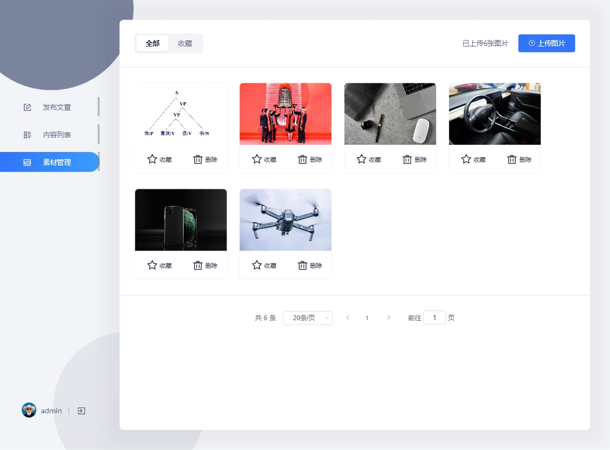
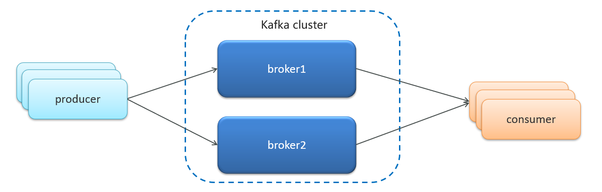
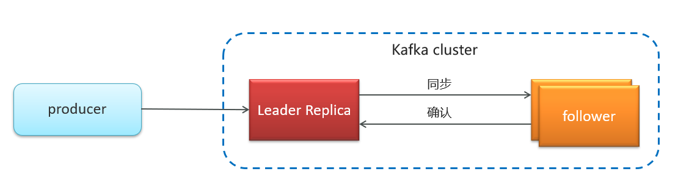
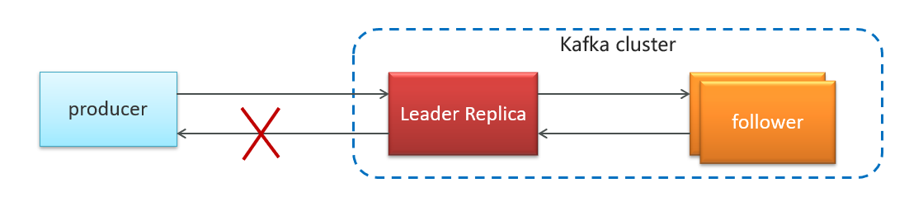
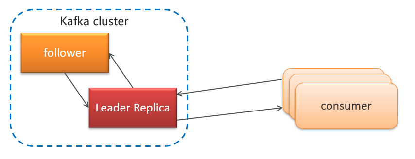
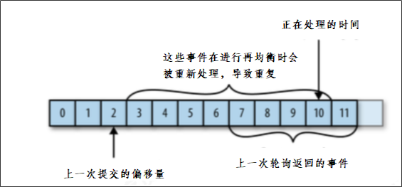
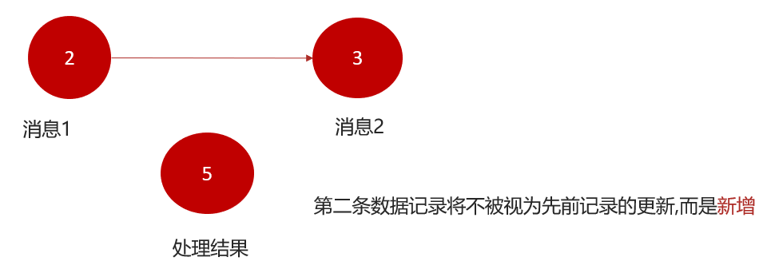

# 新闻资讯项目总结

## 1.1 项目概述

本项目主要着手于获取最新最热新闻资讯，通过大数据分析用户喜好精确推送咨询新闻。

## 1.2 功能架构图


### 1.2.1 APP端主要功能大纲

- 频道栏：用户可以通过此功能添加自己感兴趣的频道，在添加标签时，系统可依据用户喜好进行推荐
- **文章列表：需要显示文章标题、文章图片、评论数等信息，且需要监控文章是否在APP端展现的行为**
- **搜索文章：联想用户想搜索的内容，并记录用户的历史搜索信息**
- 个人中心：用户可以在其个人中心查看收藏、关注的人、以及系统设置等功能
- **查看文章：用户点击文章进入查看文章页面，在此页面上可进行点赞、评论、不喜欢、分享等操作；除此之外还需要收集用户查看文章的时间，是否看我等行为信息**
- **实名认证：用户可以进行身份证认证和实名认证，实名认证之后即可成为自媒体人，在平台上发布文章**
- 注册登录：登录时，验证内容为手机号登录/注册，通过手机号验证码进行登录/注册，首次登录用户自动注册账号。


### 1.2.2 自媒体端功能大纲

- **内容管理：自媒体用户管理文章页面，可以根据条件进行筛选，文章包含草稿、已发布、未通过、已撤回状态。用户可以对文章进行修改，上/下架操作、查看文章状态等操作**
- 评论管理：管理文章评论页面，显示用户已发布的全部文章，可以查看文章总评论数和粉丝评论数，可以对文章进行关闭评论等操作
- **素材管理：管理自媒体文章发布的图片，便于用户发布带有多张图片的文章**
- **图文数据：自媒体人发布文章的数据：阅读数、评论数、收藏数、转发量，用户可以查看对应文章的阅读数据**
- 粉丝画像：内容包括：粉丝性别分布、粉丝年龄分布、粉丝终端分布、粉丝喜欢分类分布


### 1.2.3 平台管理端功能大纲

- 用户管理：系统后台用来维护用户信息，可以对用户进行增删改查操作，对于违规用户可以进行冻结操
- 用户审核：管理员审核用户信息页面，用户审核分为身份审核和实名审核，身份审核是对用户的身份信息进行审核，包括但不限于工作信息、资质信息、经历信息等；实名认证是对用户实名身份进行认证
- 内容管理：管理员查询现有文章，并对文章进行新增、删除、修改、置顶等操作
- **内容审核：管理员审核自媒体人发布的内容，包括但不限于文章文字、图片、敏感信息等**
- 频道管理：管理频道分类界面，可以新增频道，查看频道，新增或修改频道关联的标签
- 网站统计：统计内容包括：日活用户、访问量、新增用户、访问量趋势、热门搜索、用户地区分布等数据
- 内容统计：统计内容包括：文章采集量、发布量、阅读量、阅读时间、评论量、转发量、图片量等数据
- 权限管理：超级管理员对后台管理员账号进行新增或删除角色操作


## 1.3 交互界面

### 1.3.1 APP端主要界面

#### APP端登录界面


#### APP端新闻推荐页


#### APP端新闻详情页


#### APP端历史搜索栏


#### APP端热搜榜


### 1.3.2 自媒体端主要界面

#### 自媒体端发表文章


#### 自媒体端内容列表


#### 自媒体端素材管理



#### 自媒体端上传图片


## 1.4 技术栈


- **Spring-Cloud-Gateway : 微服务之前架设的网关服务，实现服务注册中的API请求路由，以及控制流速控制和熔断处理都是常用的架构手段，而这些功能Gateway天然支持。**
- **运用Spring Boot快速开发框架，构建项目工程；并结合Spring Cloud全家桶技术，实现后端个人中心、自媒体、管理中心等微服务。**
- **运用Spring Cloud Alibaba Nacos作为项目中的注册中心和配置中心。**
- **运用mybatis-plus作为持久层提升开发效率。**
- **运用Kafka完成内部系统消息通知；与客户端系统消息通知；以及实时数据计算**
- **运用Redis缓存技术，实现热数据的计算，提升系统性能指标。**
- **使用Mysql存储用户数据，以保证上层数据查询的高性能。**
- **使用MongoDB存储用户热数据，以保证用户热数据高扩展和高性能指标。**
- 使用FastDFS作为静态资源存储器，在其上实现热静态资源缓存、淘汰等功能。
- 运用Hbase技术，存储系统中的冷数据，保证系统数据的可靠性。
- **运用ElasticSearch搜索技术，对冷数据、文章数据建立索引，以保证冷数据、文章查询性能。**
- PMD&P3C : 静态代码扫描工具，在项目中扫描项目代码，检查异常点、优化点、代码规范等，为开发团队提供规范统一，提升项目代码质量。


## 1.5 工程主体结构


## 1.6 NACOS注册中心和配置中心

项目设计以nacos作为微服务配置中心的核心组件，nacos是一个更易于构建云原生应用的动态服务发现、配置管理和服务管理平台。


### 在nacos中配置（示例）

#### leadnews-user

bootstrap.yml

```yaml
server:
  port: 51801
spring:
  application:
    name: leadnews-user
  cloud:
    nacos:
      discovery:
        server-addr: 192.168.200.130:8848
      config:
        server-addr: 192.168.200.130:8848
        file-extension: yml
```

在nacos中创建配置文件


```yaml
spring:
  redis:
    host: 192.168.200.130
    password: leadnews
    port: 6379
  datasource:
    driver-class-name: com.mysql.cj.jdbc.Driver
    url: jdbc:mysql://localhost:3306/leadnews_user?useUnicode=true&characterEncoding=UTF-8&serverTimezone=UTC
    username: root
    password: 123456
# 设置Mapper接口所对应的XML文件位置，如果你在Mapper接口中有自定义方法，需要进行该配置
mybatis-plus:
  mapper-locations: classpath*:mapper/*.xml
  # 设置别名包扫描路径，通过该属性可以给包中的类注册别名
  type-aliases-package: com.leadnews.model.user.pojos
```


#### leadnews-app-gateway

bootstrap.yml

```yaml
server:
  port: 51601
spring:
  application:
    name: leadnews-app-gateway
  cloud:
    nacos:
      discovery:
        server-addr: 192.168.200.130:8848
      config:
        server-addr: 192.168.200.130:8848
        file-extension: yml
```

在nacos的配置中心创建leadnews-app-gateway的yml配置


```yaml
spring:
  cloud:
    gateway:
      globalcors:
        add-to-simple-url-handler-mapping: true
        corsConfigurations:
          '[/**]':
            allowedHeaders: "*"
            allowedOrigins: "*"
            allowedMethods:
              - GET
              - POST
              - DELETE
              - PUT
              - OPTION
      routes:
        # 用户微服务
        - id: user
          uri: lb://leadnews-user
          predicates:
            - Path=/user/**
          filters:
            - StripPrefix= 1
        # 文章微服务
        - id: article
          uri: lb://leadnews-article
          predicates:
            - Path=/article/**
          filters:
            - StripPrefix= 1
        #搜索微服务
        - id: leadnews-search
          uri: lb://leadnews-search
          predicates:
            - Path=/search/**
          filters:
            - StripPrefix= 1
        #行为微服务
        - id: leadnews-behavior
          uri: lb://leadnews-behavior
          predicates:
            - Path=/behavior/**
          filters:
            - StripPrefix= 1
        #评论微服务
        - id: leadnews-comment
          uri: lb://leadnews-comment
          predicates:
            - Path=/comment/**
          filters:
            - StripPrefix= 1
```

环境搭建完成以后，启动项目网关和用户两个服务，使用Apifox进行测试

请求地址：http://localhost:51601/user/api/v1/login/login_auth   


## 1.7 全局过滤器实现jwt校验


思路分析：

1. 用户进入网关开始登陆，网关过滤器进行判断，如果是登录，则路由到后台管理微服务进行登录
2. 用户登录成功，后台管理微服务签发JWT TOKEN信息返回给用户
3. 用户再次进入网关开始访问，网关过滤器接收用户携带的TOKEN 
4. 网关过滤器解析TOKEN ，判断是否有权限，如果有，则放行，如果没有则返回未认证错误


具体实现：

第一：

​	在认证过滤器中需要用到jwt的解析，所以需要把工具类拷贝一份到网关微服务

第二：

在网关微服务中新建全局过滤器：

```java
package com.leadnews.app.gateway.filter;


import com.leadnews.app.gateway.util.AppJwtUtil;
import io.jsonwebtoken.Claims;
import lombok.extern.slf4j.Slf4j;
import org.apache.commons.lang.StringUtils;
import org.springframework.cloud.gateway.filter.GatewayFilterChain;
import org.springframework.cloud.gateway.filter.GlobalFilter;
import org.springframework.core.Ordered;
import org.springframework.http.HttpStatus;
import org.springframework.http.server.reactive.ServerHttpRequest;
import org.springframework.http.server.reactive.ServerHttpResponse;
import org.springframework.stereotype.Component;
import org.springframework.web.server.ServerWebExchange;
import reactor.core.publisher.Mono;

@Component
@Slf4j
public class AuthorizeFilter implements Ordered, GlobalFilter {
    @Override
    public Mono<Void> filter(ServerWebExchange exchange, GatewayFilterChain chain) {
        //1.获取request和response对象
        ServerHttpRequest request = exchange.getRequest();
        ServerHttpResponse response = exchange.getResponse();

        //2.判断是否是登录
        if(request.getURI().getPath().contains("/login")){
            //放行
            return chain.filter(exchange);
        }


        //3.获取token
        String token = request.getHeaders().getFirst("token");

        //4.判断token是否存在
        if(StringUtils.isBlank(token)){
            response.setStatusCode(HttpStatus.UNAUTHORIZED);
            return response.setComplete();
        }

        //5.判断token是否有效
        try {
            Claims claimsBody = AppJwtUtil.getClaimsBody(token);
            //是否是过期
            int result = AppJwtUtil.verifyToken(claimsBody);
            if(result == 1 || result  == 2){
                response.setStatusCode(HttpStatus.UNAUTHORIZED);
                return response.setComplete();
            }
        }catch (Exception e){
            e.printStackTrace();
            response.setStatusCode(HttpStatus.UNAUTHORIZED);
            return response.setComplete();
        }

        //6.放行
        return chain.filter(exchange);
    }

    /**
     * 优先级设置  值越小  优先级越高
     * @return
     */
    @Override
    public int getOrder() {
        return 0;
    }
}
```

测试：

启动user服务，继续访问其他微服务，会提示需要认证才能访问，这个时候需要在heads中设置设置token才能正常访问。


## 1.8 模板引擎freemarker

### 1.8.1 freemarker 介绍

​	FreeMarker 是一款 模板引擎： 即一种基于模板和要改变的数据， 并用来生成输出文本(HTML网页，电子邮件，配置文件，源代码等)的通用工具。 它不是面向最终用户的，而是一个Java类库，是一款程序员可以嵌入他们所开发产品的组件。

​	模板编写为FreeMarker Template Language (FTL)。它是简单的，专用的语言， *不是* 像PHP那样成熟的编程语言。 那就意味着要准备数据在真实编程语言中来显示，比如数据库查询和业务运算， 之后模板显示已经准备好的数据。在模板中，你可以专注于如何展现数据， 而在模板之外可以专注于要展示什么数据。


常用的java模板引擎还有哪些？

Jsp、Freemarker、Thymeleaf 、Velocity 等。

1、Jsp 为 Servlet 专用，不能单独进行使用。

2、Thymeleaf 为新技术，功能较为强大，但是执行的效率比较低。

3、Velocity从2010年更新完 2.0 版本后，便没有在更新。Spring Boot 官方在 1.4 版本后对此也不在支持，虽然 Velocity 在 2017 年版本得到迭代，但为时已晚。 


freemarker作为springmvc一种视图格式，默认情况下SpringMVC支持freemarker视图格式。


## 1.9 对象存储服务MinIO

### 1.9.1 MinIO简介

MinIO基于Apache License v2.0开源协议的对象存储服务，可以做为云存储的解决方案用来保存海量的图片，视频，文档。由于采用Golang实现，服务端可以工作在Windows,Linux, OS X和FreeBSD上。配置简单，基本是复制可执行程序，单行命令可以运行起来。

MinIO兼容亚马逊S3云存储服务接口，非常适合于存储大容量非结构化的数据，例如图片、视频、日志文件、备份数据和容器/虚拟机镜像等，而一个对象文件可以是任意大小，从几kb到最大5T不等。

**S3 （ Simple Storage Service简单存储服务）**

基本概念

- bucket – 类比于文件系统的目录
- Object – 类比文件系统的文件
- Keys – 类比文件名

官网文档：http://docs.minio.org.cn/docs/

### 1.9.2 MinIO特点

- 数据保护

  Minio使用Minio Erasure Code（纠删码）来防止硬件故障。即便损坏一半以上的driver，但是仍然可以从中恢复。

- 高性能

  作为高性能对象存储，在标准硬件条件下它能达到55GB/s的读、35GB/s的写速率

- 可扩容

  不同MinIO集群可以组成联邦，并形成一个全局的命名空间，并跨越多个数据中心

- SDK支持

  基于Minio轻量的特点，它得到类似Java、Python或Go等语言的sdk支持

- 有操作页面

  面向用户友好的简单操作界面，非常方便的管理Bucket及里面的文件资源

- 功能简单

  这一设计原则让MinIO不容易出错、更快启动

- 丰富的API

  支持文件资源的分享连接及分享链接的过期策略、存储桶操作、文件列表访问及文件上传下载的基本功能等。

- 文件变化主动通知

  存储桶（Bucket）如果发生改变,比如上传对象和删除对象，可以使用存储桶事件通知机制进行监控，并通过以下方式发布出去:AMQP、MQTT、Elasticsearch、Redis、NATS、MySQL、Kafka、Webhooks等。


## 1.10 消息系统kafka

### 1.10.1 kafka概述

消息中间件对比                              

| 特性       | ActiveMQ                               | RabbitMQ                   | RocketMQ                 | Kafka                                    |
| ---------- | -------------------------------------- | -------------------------- | ------------------------ | ---------------------------------------- |
| 开发语言   | java                                   | erlang                     | java                     | scala                                    |
| 单机吞吐量 | 万级                                   | 万级                       | 10万级                   | 100万级                                  |
| 时效性     | ms                                     | us                         | ms                       | ms级以内                                 |
| 可用性     | 高（主从）                             | 高（主从）                 | 非常高（分布式）         | 非常高（分布式）                         |
| 功能特性   | 成熟的产品、较全的文档、各种协议支持好 | 并发能力强、性能好、延迟低 | MQ功能比较完善，扩展性佳 | 只支持主要的MQ功能，主要应用于大数据领域 |

消息中间件对比-选择建议

| **消息中间件** | **建议**                                                     |
| -------------- | ------------------------------------------------------------ |
| Kafka          | 追求高吞吐量，适合产生大量数据的互联网服务的数据收集业务     |
| RocketMQ       | 可靠性要求很高的金融互联网领域,稳定性高，经历了多次阿里双11考验 |
| RabbitMQ       | 性能较好，社区活跃度高，数据量没有那么大，优先选择功能比较完备的RabbitMQ |

### 1.10.2 kafka介绍

Kafka 是一个分布式流媒体平台,类似于消息队列或企业消息传递系统。kafka官网：http://kafka.apache.org/  


kafka介绍-名词解释


- producer：发布消息的对象称之为主题生产者（Kafka topic producer）

- topic：Kafka将消息分门别类，每一类的消息称之为一个主题（Topic）

- consumer：订阅消息并处理发布的消息的对象称之为主题消费者（consumers）

- broker：已发布的消息保存在一组服务器中，称之为Kafka集群。集群中的每一个服务器都是一个代理（Broker）。 消费者可以订阅一个或多个主题（topic），并从Broker拉数据，从而消费这些已发布的消息。


生产者发送消息和消费者接收消息

1、生产者发送消息，多个消费者订阅同一个主题，一个组中只能有一个消费者收到消息（一对一）


2、生产者发送消息，多个消费者订阅同一个主题，不同组中所有消费者都能收到消息（一对多）


### 1.10.3 kafka高可用设计

#### 1.10.3.1 集群



- Kafka 的服务器端由被称为 Broker 的服务进程构成，即一个 Kafka 集群由多个 Broker 组成

- 这样如果集群中某一台机器宕机，其他机器上的 Broker 也依然能够对外提供服务。这其实就是 Kafka 提供高可用的手段之一

#### 1.10.3.2 备份机制(Replication）



Kafka 中消息的备份又叫做 副本（Replica）

Kafka 定义了两类副本：

- 领导者副本（Leader Replica）

- 追随者副本（Follower Replica）

**同步方式**


ISR（in-sync replica）需要同步复制保存的follower


如果leader失效后，需要选出新的leader，选举的原则如下：

第一：选举时优先从ISR中选定，因为这个列表中follower的数据是与leader同步的

第二：如果ISR列表中的follower都不行了，就只能从其他follower中选取


极端情况，就是所有副本都失效了，这时有两种方案

第一：等待ISR中的一个活过来，选为Leader，数据可靠，但活过来的时间不确定

第二：选择第一个活过来的Replication，不一定是ISR中的，选为leader，以最快速度恢复可用性，但数据不一定完整


### 1.10.4 kafka生产者详解

#### 1.10.4.1 发送类型

- 同步发送

  使用send()方法发送，它会返回一个Future对象，调用get()方法进行等待，就可以知道消息是否发送成功

```java
RecordMetadata recordMetadata = producer.send(kvProducerRecord).get();
System.out.println(recordMetadata.offset());
```

- 异步发送

  调用send()方法，并指定一个回调函数，服务器在返回响应时调用函数

```java
//异步消息发送
producer.send(kvProducerRecord, new Callback() {
    @Override
    public void onCompletion(RecordMetadata recordMetadata, Exception e) {
        if(e != null){
            System.out.println("记录异常信息到日志表中");
        }
        System.out.println(recordMetadata.offset());
    }
});
```

#### 1.10.4.2 参数详解

- ack


代码的配置方式：

```java
//ack配置  消息确认机制
prop.put(ProducerConfig.ACKS_CONFIG,"all");
```

参数的选择说明

| **确认机制**     | **说明**                                                     |
| ---------------- | ------------------------------------------------------------ |
| acks=0           | 生产者在成功写入消息之前不会等待任何来自服务器的响应,消息有丢失的风险，但是速度最快 |
| acks=1（默认值） | 只要集群首领节点收到消息，生产者就会收到一个来自服务器的成功响应 |
| acks=all         | 只有当所有参与赋值的节点全部收到消息时，生产者才会收到一个来自服务器的成功响应 |

- retries



生产者从服务器收到的错误有可能是临时性错误，在这种情况下，retries参数的值决定了生产者可以重发消息的次数，如果达到这个次数，生产者会放弃重试返回错误，默认情况下，生产者会在每次重试之间等待100ms

代码中配置方式：

```java
//重试次数
prop.put(ProducerConfig.RETRIES_CONFIG,10);
```

- 消息压缩

默认情况下， 消息发送时不会被压缩。

代码中配置方式：

```java
//数据压缩
prop.put(ProducerConfig.COMPRESSION_TYPE_CONFIG,"lz4");
```

| **压缩算法** | **说明**                                                     |
| ------------ | ------------------------------------------------------------ |
| snappy       | 占用较少的  CPU，  却能提供较好的性能和相当可观的压缩比， 如果看重性能和网络带宽，建议采用 |
| lz4          | 占用较少的 CPU， 压缩和解压缩速度较快，压缩比也很客观        |
| gzip         | 占用较多的  CPU，但会提供更高的压缩比，网络带宽有限，可以使用这种算法 |

使用压缩可以降低网络传输开销和存储开销，而这往往是向 Kafka 发送消息的瓶颈所在。


### 1.10.5 kafka消费者详解

#### 1.10.5.1 消费者组



- 消费者组（Consumer Group） ：指的就是由一个或多个消费者组成的群体

- 一个发布在Topic上消息被分发给此消费者组中的一个消费者

  - 所有的消费者都在一个组中，那么这就变成了queue模型

  - 所有的消费者都在不同的组中，那么就完全变成了发布-订阅模型

#### 1.10.5.2 消息有序性

应用场景：

- 即时消息中的单对单聊天和群聊，保证发送方消息发送顺序与接收方的顺序一致

- 充值转账两个渠道在同一个时间进行余额变更，短信通知必须要有顺序


topic分区中消息只能由消费者组中的唯一一个消费者处理，所以消息肯定是按照先后顺序进行处理的。但是它也仅仅是保证Topic的一个分区顺序处理，不能保证跨分区的消息先后处理顺序。 所以，如果你想要顺序的处理Topic的所有消息，那就只提供一个分区。

#### 1.10.5.3 提交和偏移量

kafka不会像其他JMS队列那样需要得到消费者的确认，消费者可以使用kafka来追踪消息在分区的位置（偏移量）。

消费者会往一个叫做_consumer_offset的特殊主题发送消息，消息里包含了每个分区的偏移量。如果消费者发生崩溃或有新的消费者加入群组，就会触发再均衡。


正常的情况


如果消费者2挂掉以后，会发生再均衡，消费者2负责的分区会被其他消费者进行消费

再均衡后不可避免会出现一些问题

问题一：



如果提交偏移量小于客户端处理的最后一个消息的偏移量，那么处于两个偏移量之间的消息就会被重复处理。


问题二：


如果提交的偏移量大于客户端的最后一个消息的偏移量，那么处于两个偏移量之间的消息将会丢失。


如果想要解决这些问题，还要知道目前kafka提交偏移量的方式：

提交偏移量的方式有两种，分别是自动提交偏移量和手动提交

- 自动提交偏移量

当enable.auto.commit被设置为true，提交方式就是让消费者自动提交偏移量，每隔5秒消费者会自动把从poll()方法接收的最大偏移量提交上去

- 手动提交 ，当enable.auto.commit被设置为false可以有以下三种提交方式

  - 提交当前偏移量（同步提交）

  - 异步提交

  - 同步和异步组合提交


1.提交当前偏移量（同步提交）

把`enable.auto.commit`设置为false,让应用程序决定何时提交偏移量。使用commitSync()提交偏移量，commitSync()将会提交poll返回的最新的偏移量，所以在处理完所有记录后要确保调用了commitSync()方法。否则还是会有消息丢失的风险。

只要没有发生不可恢复的错误，commitSync()方法会一直尝试直至提交成功，如果提交失败也可以记录到错误日志里。

```java
while (true){
    ConsumerRecords<String, String> records = consumer.poll(Duration.ofMillis(1000));
    for (ConsumerRecord<String, String> record : records) {
        System.out.println(record.value());
        System.out.println(record.key());
        try {
            consumer.commitSync();//同步提交当前最新的偏移量
        }catch (CommitFailedException e){
            System.out.println("记录提交失败的异常："+e);
        }

    }
}
```

2.异步提交

手动提交有一个缺点，那就是当发起提交调用时应用会阻塞。当然我们可以减少手动提交的频率，但这个会增加消息重复的概率（和自动提交一样）。另外一个解决办法是，使用异步提交的API。

```java
while (true){
    ConsumerRecords<String, String> records = consumer.poll(Duration.ofMillis(1000));
    for (ConsumerRecord<String, String> record : records) {
        System.out.println(record.value());
        System.out.println(record.key());
    }
    consumer.commitAsync(new OffsetCommitCallback() {
        @Override
        public void onComplete(Map<TopicPartition, OffsetAndMetadata> map, Exception e) {
            if(e!=null){
                System.out.println("记录错误的提交偏移量："+ map+",异常信息"+e);
            }
        }
    });
}
```

3.同步和异步组合提交

异步提交也有个缺点，那就是如果服务器返回提交失败，异步提交不会进行重试。相比较起来，同步提交会进行重试直到成功或者最后抛出异常给应用。异步提交没有实现重试是因为，如果同时存在多个异步提交，进行重试可能会导致位移覆盖。

举个例子，假如我们发起了一个异步提交commitA，此时的提交位移为2000，随后又发起了一个异步提交commitB且位移为3000；commitA提交失败但commitB提交成功，此时commitA进行重试并成功的话，会将实际上将已经提交的位移从3000回滚到2000，导致消息重复消费。

```java
try {
    while (true){
        ConsumerRecords<String, String> records = consumer.poll(Duration.ofMillis(1000));
        for (ConsumerRecord<String, String> record : records) {
            System.out.println(record.value());
            System.out.println(record.key());
        }
        consumer.commitAsync();
    }
}catch (Exception e){+
    e.printStackTrace();
    System.out.println("记录错误信息："+e);
}finally {
    try {
        consumer.commitSync();
    }finally {
        consumer.close();
    }
}
```


## 1.11 数据库MongoDB

APP端用户的搜索记录，需要给每一个用户都保存一份，数据量较大，要求加载速度快，通常这样的数据存储到MongoDB更合适，不建议直接存储到关系型数据库中。


## 1.12 内存数据库Redis

APP端用户查询文章列表的时候，优先从redis中查询热度较高的文章数据。

打开Redis Desktop Manager，输入host、port、password链接测试


建立连接


### 1.12.1 Redis简介

Redis（Remote Dictionary Server）是一个开源的内存数据库，遵守 BSD 协议，它提供了一个高性能的键值（key-value）存储系统，常用于缓存、消息队列、会话存储等应用场景。

- **性能极高：**Redis 以其极高的性能而著称，能够支持每秒数十万次的读写操作24。这使得Redis成为处理高并发请求的理想选择，尤其是在需要快速响应的场景中，如缓存、会话管理、排行榜等。
- **丰富的数据类型：**Redis 不仅支持基本的键值存储，还提供了丰富的数据类型，包括字符串、列表、集合、哈希表、有序集合等。这些数据类型为开发者提供了灵活的数据操作能力，使得Redis可以适应各种不同的应用场景。
- **原子性操作：**Redis 的所有操作都是原子性的，这意味着操作要么完全执行，要么完全不执行。这种特性对于确保数据的一致性和完整性至关重要，尤其是在高并发环境下处理事务时。
- **持久化：**Redis 支持数据的持久化，可以将内存中的数据保存到磁盘中，以便在系统重启后恢复数据。这为 Redis 提供了数据安全性，确保数据不会因为系统故障而丢失。
- **支持发布/订阅模式：**Redis 内置了发布/订阅模式（Pub/Sub），允许客户端之间通过消息传递进行通信。这使得 Redis 可以作为消息队列和实时数据传输的平台。
- **单线程模型：**尽管 Redis 是单线程的，但它通过高效的事件驱动模型来处理并发请求，确保了高性能和低延迟。单线程模型也简化了并发控制的复杂性。
- **主从复制：**Redis 支持主从复制，可以通过从节点来备份数据或分担读请求，提高数据的可用性和系统的伸缩性。
- **应用场景广泛：**Redis 被广泛应用于各种场景，包括但不限于缓存系统、会话存储、排行榜、实时分析、地理空间数据索引等。
- **社区支持：**Redis 拥有一个活跃的开发者社区，提供了大量的文档、教程和第三方库，这为开发者提供了强大的支持和丰富的资源。
- **跨平台兼容性：**Redis 可以在多种操作系统上运行，包括 Linux、macOS 和 Windows，这使得它能够在不同的技术栈中灵活部署。


## 1.13 搜索引擎ElasticSearch

为了加快检索的效率，在查询的时候不会直接从数据库中查询文章，需要在ElasticSearch中进行高速检索。


## 1.14 分布式任务调度框架 xxl-job

spring传统的定时任务@Scheduled，但是这样存在这一些问题 ：

- 做集群任务的重复执行问题

- cron表达式定义在代码之中，修改不方便

- 定时任务失败了，无法重试也没有统计

- 如果任务量过大，不能有效的分片执行

解决这些问题的方案为：

xxl-job 分布式任务调度框架


### 1.14.1 什么是分布式任务调度

当前软件的架构已经开始向分布式架构转变，将单体结构拆分为若干服务，服务之间通过网络交互来完成业务处理。在分布式架构下，一个服务往往会部署多个实例来运行我们的业务，如果在这种分布式系统环境下运行任务调度，我们称之为**分布式任务调度**。


将任务调度程序分布式构建，这样就可以具有分布式系统的特点，并且提高任务的调度处理能力：

1、并行任务调度

并行任务调度实现靠多线程，如果有大量任务需要调度，此时光靠多线程就会有瓶颈了，因为一台计算机CPU的处理能力是有限的。

如果将任务调度程序分布式部署，每个结点还可以部署为集群，这样就可以让多台计算机共同去完成任务调度，我们可以将任务分割为若干个分片，由不同的实例并行执行，来提高任务调度的处理效率。

2、高可用

若某一个实例宕机，不影响其他实例来执行任务。

3、弹性扩容

当集群中增加实例就可以提高并执行任务的处理效率。

4、任务管理与监测

对系统中存在的所有定时任务进行统一的管理及监测。让开发人员及运维人员能够时刻了解任务执行情况，从而做出快速的应急处理响应。

**分布式任务调度面临的问题：**

当任务调度以集群方式部署，同一个任务调度可能会执行多次，例如：电商系统定期发放优惠券，就可能重复发放优惠券，对公司造成损失，信用卡还款提醒就会重复执行多次，给用户造成烦恼，所以我们需要控制相同的任务在多个运行实例上只执行一次。常见解决方案：

- 分布式锁，多个实例在任务执行前首先需要获取锁，如果获取失败那么就证明有其他服务已经在运行，如果获取成功那么证明没有服务在运行定时任务，那么就可以执行。
- ZooKeeper选举，利用ZooKeeper对Leader实例执行定时任务，执行定时任务的时候判断自己是否是Leader，如果不是则不执行，如果是则执行业务逻辑，这样也能达到目的。


### 1.14.2 xxl-Job简介

针对分布式任务调度的需求，市场上出现了很多的产品：

1） TBSchedule：淘宝推出的一款非常优秀的高性能分布式调度框架，目前被应用于阿里、京东、支付宝、国美等很多互联网企业的流程调度系统中。但是已经多年未更新，文档缺失严重，缺少维护。

2） XXL-Job：大众点评的分布式任务调度平台，是一个轻量级分布式任务调度平台, 其核心设计目标是开发迅速、学习简单、轻量级、易扩展。现已开放源代码并接入多家公司线上产品线，开箱即用。

3）Elastic-job：当当网借鉴TBSchedule并基于quartz 二次开发的弹性分布式任务调度系统，功能丰富强大，采用zookeeper实现分布式协调，具有任务高可用以及分片功能。

4）Saturn： 唯品会开源的一个分布式任务调度平台，基于Elastic-job，可以全域统一配置，统一监
控，具有任务高可用以及分片功能。 

XXL-JOB是一个分布式任务调度平台，其核心设计目标是开发迅速、学习简单、轻量级、易扩展。现已开放源代码并接入多家公司线上产品线，开箱即用。

源码地址：https://gitee.com/xuxueli0323/xxl-job

文档地址：https://www.xuxueli.com/xxl-job/

**特性**

- **简单灵活**
  提供Web页面对任务进行管理，管理系统支持用户管理、权限控制；
  支持容器部署；
  支持通过通用HTTP提供跨平台任务调度；
- **丰富的任务管理功能**
  支持页面对任务CRUD操作；
  支持在页面编写脚本任务、命令行任务、Java代码任务并执行；
  支持任务级联编排，父任务执行结束后触发子任务执行；
  支持设置指定任务执行节点路由策略，包括轮询、随机、广播、故障转移、忙碌转移等；
  支持Cron方式、任务依赖、调度中心API接口方式触发任务执行
- **高性能**
  任务调度流程全异步化设计实现，如异步调度、异步运行、异步回调等，有效对密集调度进行流量削峰；
- **高可用**
  任务调度中心、任务执行节点均 集群部署，支持动态扩展、故障转移
  支持任务配置路由故障转移策略，执行器节点不可用是自动转移到其他节点执行
  支持任务超时控制、失败重试配置
  支持任务处理阻塞策略：调度当任务执行节点忙碌时来不及执行任务的处理策略，包括：串行、抛弃、覆盖策略
- **易于监控运维**
  支持设置任务失败邮件告警，预留接口支持短信、钉钉告警；
  支持实时查看任务执行运行数据统计图表、任务进度监控数据、任务完整执行日志；


xxl-job任务管理


xxl-job执行器管理


## 1.15 流式计算Kafka Stream

### 1.15.1 实时流式计算

#### 1.15.1.1 概念

一般流式计算会与批量计算相比较。在流式计算模型中，输入是持续的，可以认为在时间上是无界的，也就意味着，永远拿不到全量数据去做计算。同时，计算结果是持续输出的，也即计算结果在时间上也是无界的。流式计算一般对实时性要求较高，同时一般是先定义目标计算，然后数据到来之后将计算逻辑应用于数据。同时为了提高计算效率，往往尽可能采用增量计算代替全量计算。

#### 1.15.1.2 应用场景

- 日志分析

  网站的用户访问日志进行实时的分析，计算访问量，用户画像，留存率等等，实时的进行数据分析，帮助企业进行决策

- 大屏看板统计

  可以实时的查看网站注册数量，订单数量，购买数量，金额等。

- 公交实时数据

  可以随时更新公交车方位，计算多久到达站牌等

- 实时文章分值计算

  头条类文章的分值计算，通过用户的行为实时文章的分值，分值越高就越被推荐。

#### 1.15.1.3 技术方案选型

- Hadoop 

  Hadoop 是一个用Java 语言编写的开源框架，用于大规模数据的存储和处理。它通过分布式存储和并行处理来处理大数据集，将工作负载分解成可以在集群中并行运行的小型任务。Hadoop 主要由四个模块组成：Hadoop 核心、HDFS、MapReduce 和 YARN。

- Apche Storm

  Apche Storm 是一个分布式实时大数据处理系统，可以帮助我们方便地处理海量数据，具有高可靠、高容错、高扩展的特点。是流式框架，有很高的数据吞吐能力。

- Kafka Stream 

  Kafka Stream 可以轻松地将其嵌入任何Java应用程序中，并与用户为其流应用程序所拥有的任何现有打包，部署和操作工具集成。


### 1.15.2 Kafka Stream

#### 1.15.2.1 概述

Kafka Stream是Apache Kafka从0.10版本引入的一个新Feature。它是提供了对存储于Kafka内的数据进行流式处理和分析的功能。

Kafka Stream的特点如下：

- Kafka Stream提供了一个非常简单而轻量的Library，它可以非常方便地嵌入任意Java应用中，也可以任意方式打包和部署
- 除了Kafka外，无任何外部依赖
- 充分利用Kafka分区机制实现水平扩展和顺序性保证
- 通过可容错的state store实现高效的状态操作（如windowed join和aggregation）
- 支持正好一次处理语义
- 提供记录级的处理能力，从而实现毫秒级的低延迟
- 支持基于事件时间的窗口操作，并且可处理晚到的数据（late arrival of records）
- 同时提供底层的处理原语Processor（类似于Storm的spout和bolt），以及高层抽象的DSL（类似于Spark的map/group/reduce）


#### 1.15.2.2 Kafka Stream的关键概念

- **源处理器（Source Processor）**：源处理器是一个没有任何上游处理器的特殊类型的流处理器。它从一个或多个kafka主题生成输入流。通过消费这些主题的消息并将它们转发到下游处理器。
- **Sink处理器**：sink处理器是一个没有下游流处理器的特殊类型的流处理器。它接收上游流处理器的消息发送到一个指定的**Kafka主题**。


#### 1.15.2.3 KStream

（1）数据结构类似于map,如下图，key-value键值对


（2）KStream



**KStream**数据流（data stream），即是一段顺序的，可以无限长，不断更新的数据集。
数据流中比较常记录的是事件，这些事件可以是一次鼠标点击（click），一次交易，或是传感器记录的位置数据。

KStream负责抽象的，就是数据流。与Kafka自身topic中的数据一样，类似日志，每一次操作都是**向其中插入（insert）新数据。**

为了说明这一点，让我们想象一下以下两个数据记录正在发送到流中：

（“alice”，1）->（“alice”，3）

如果流处理应用是要总结每个用户的价值，它将返回（“alice”，4）。为什么？因为第二条数据记录将不被视为先前记录的更新。


