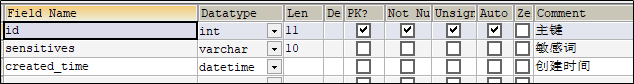

# 一、MySQL数据库设计

## 1.1 核心数据流转图


说明：整个项目其核心数据为文章信息，上图主要说明文章的数据流转

1、爬虫系统从网站采集数据后存入爬虫库，即爬虫库中保存了一份采集的文章信息。

2、自媒体人可以通过发布文章后首先进入自媒体库。

3、爬虫文章和自媒体文章最后都要经过审核成功后入appinfo库，这里面的文章信息，最终是要给APP端用户所查看。

4、在APP端用户查看的时候，需要记录用户的一些行为，如转发、评论、点赞等需要入用户行为库。


## 1.2 leadnews_user 数据库

关于APP端用户相关的内容较多，可以单独设置一个数据库leadnews_user

### 1.2.1 用户表结构分析

| **表名称**       | **说明**          |
| ---------------- | ----------------- |
| ap_user          | APP用户信息表     |
| ap_user_realname | APP实名认证信息表 |

### 1.2.2 ap_user APP用户信息表

登录需要用到的是ap_user表，表结构如下：


项目中的持久层使用的mybatis-plus。

app_user表对应的实体类如下：

```java
package com.leadnews.model.user.pojos;

import com.baomidou.mybatisplus.annotation.IdType;
import com.baomidou.mybatisplus.annotation.TableField;
import com.baomidou.mybatisplus.annotation.TableId;
import com.baomidou.mybatisplus.annotation.TableName;
import lombok.Data;

import java.io.Serializable;
import java.util.Date;

/**
 * APP用户信息表
 */
@Data
@TableName("ap_user")
public class ApUser implements Serializable {

    private static final long serialVersionUID = 1L;

    /**
     * 主键
     */
    @TableId(value = "id", type = IdType.AUTO)
    private Integer id;

    /**
     * 密码、通信等加密盐
     */
    @TableField("salt")
    private String salt;

    /**
     * 用户名
     */
    @TableField("name")
    private String name;

    /**
     * 密码,md5加密
     */
    @TableField("password")
    private String password;

    /**
     * 手机号
     */
    @TableField("phone")
    private String phone;

    /**
     * 头像
     */
    @TableField("image")
    private String image;

    /**
     * 0 男
     1 女
     2 未知
     */
    @TableField("sex")
    private Boolean sex;

    /**
     * 0 未
     1 是
     */
    @TableField("is_certification")
    private Boolean certification;

    /**
     * 是否身份认证
     */
    @TableField("is_identity_authentication")
    private Boolean identityAuthentication;

    /**
     * 0正常
     1锁定
     */
    @TableField("status")
    private Boolean status;

    /**
     * 0 普通用户
     1 自媒体人
     2 大V
     */
    @TableField("flag")
    private Short flag;

    /**
     * 注册时间
     */
    @TableField("created_time")
    private Date createdTime;

}
```

手动加密（md5+随机字符串）

md5是不可逆加密，md5相同的密码每次加密都一样，不太安全。在md5的基础上手动加盐（salt）处理

注册->生成盐


登录->使用盐来配合验证


用户登录流程


1、用户输入了用户名和密码进行登录，校验成功后返回jwt(基于当前用户的id生成)

2、用户游客登录，生成jwt返回(基于默认值0生成)


### 1.2.3 ap_user_realname  APP实名认证信息表


对应实体类：

```java
package com.leadnews.model.user.pojos;

import com.baomidou.mybatisplus.annotation.IdType;
import com.baomidou.mybatisplus.annotation.TableField;
import com.baomidou.mybatisplus.annotation.TableId;
import com.baomidou.mybatisplus.annotation.TableName;
import lombok.Data;

import java.io.Serializable;
import java.util.Date;

/**
 * APP实名认证信息表
 */
@Data
@TableName("ap_user_realname")
public class ApUserRealname implements Serializable {

    private static final long serialVersionUID = 1L;

    /**
     * 主键
     */
    @TableId(value = "id", type = IdType.AUTO)
    private Integer id;

    /**
     * 账号ID
     */
    @TableField("user_id")
    private Integer userId;

    /**
     * 用户名称
     */
    @TableField("name")
    private String name;

    /**
     * 资源名称
     */
    @TableField("idno")
    private String idno;

    /**
     * 正面照片
     */
    @TableField("font_image")
    private String fontImage;

    /**
     * 背面照片
     */
    @TableField("back_image")
    private String backImage;

    /**
     * 手持照片
     */
    @TableField("hold_image")
    private String holdImage;

    /**
     * 活体照片
     */
    @TableField("live_image")
    private String liveImage;

    /**
     * 状态
            0 创建中
            1 待审核
            2 审核失败
            9 审核通过
     */
    @TableField("status")
    private Short status;

    /**
     * 拒绝原因
     */
    @TableField("reason")
    private String reason;

    /**
     * 创建时间
     */
    @TableField("created_time")
    private Date createdTime;

    /**
     * 提交时间
     */
    @TableField("submited_time")
    private Date submitedTime;

    /**
     * 更新时间
     */
    @TableField("updated_time")
    private Date updatedTime;

}
```


## 1.3 leadnews_article 数据库

数据库leadnews_article用于保存和文章相关的表。

### 1.3.1 APP端文章表结构分析

| **表名称**         | **说明**       |
| ------------------ | -------------- |
| ap_article         | 文章基本信息表 |
| ap_article_config  | 文章配置表     |
| ap_article_content | 文章内容表     |

### 1.3.2 ap_article  文章基本信息表


ap_article文章表对应实体

```java
package com.leadnews.model.article.pojos;

import com.baomidou.mybatisplus.annotation.IdType;
import com.baomidou.mybatisplus.annotation.TableField;
import com.baomidou.mybatisplus.annotation.TableId;
import com.baomidou.mybatisplus.annotation.TableName;
import lombok.Data;

import java.io.Serializable;
import java.util.Date;

/**
 * 文章信息表，存储已发布的文章
 */

@Data
@TableName("ap_article")
public class ApArticle implements Serializable {

    @TableId(value = "id",type = IdType.ID_WORKER)
    private Long id;


    /**
     * 标题
     */
    private String title;

    /**
     * 作者id
     */
    @TableField("author_id")
    private Long authorId;

    /**
     * 作者名称
     */
    @TableField("author_name")
    private String authorName;

    /**
     * 频道id
     */
    @TableField("channel_id")
    private Integer channelId;

    /**
     * 频道名称
     */
    @TableField("channel_name")
    private String channelName;

    /**
     * 文章布局  0 无图文章   1 单图文章    2 多图文章
     */
    private Short layout;

    /**
     * 文章标记  0 普通文章   1 热点文章   2 置顶文章   3 精品文章   4 大V 文章
     */
    private Byte flag;

    /**
     * 文章封面图片 多张逗号分隔
     */
    private String images;

    /**
     * 标签
     */
    private String labels;

    /**
     * 点赞数量
     */
    private Integer likes;

    /**
     * 收藏数量
     */
    private Integer collection;

    /**
     * 评论数量
     */
    private Integer comment;

    /**
     * 阅读数量
     */
    private Integer views;

    /**
     * 省市
     */
    @TableField("province_id")
    private Integer provinceId;

    /**
     * 市区
     */
    @TableField("city_id")
    private Integer cityId;

    /**
     * 区县
     */
    @TableField("county_id")
    private Integer countyId;

    /**
     * 创建时间
     */
    @TableField("created_time")
    private Date createdTime;

    /**
     * 发布时间
     */
    @TableField("publish_time")
    private Date publishTime;

    /**
     * 同步状态
     */
    @TableField("sync_status")
    private Boolean syncStatus;

    /**
     * 来源
     */
    private Boolean origin;

    /**
     * 静态页面地址
     */
    @TableField("static_url")
    private String staticUrl;
}

```


### 1.3.3 ap_article_config  文章配置表


ap_article_config文章配置对应实体类

```java
package com.leadnews.model.article.pojos;

import com.baomidou.mybatisplus.annotation.IdType;
import com.baomidou.mybatisplus.annotation.TableField;
import com.baomidou.mybatisplus.annotation.TableId;
import com.baomidou.mybatisplus.annotation.TableName;
import lombok.Data;
import lombok.NoArgsConstructor;

import java.io.Serializable;

/**
 * APP已发布文章配置表
 */

@Data
@NoArgsConstructor
@TableName("ap_article_config")
public class ApArticleConfig implements Serializable {

    public ApArticleConfig(Long articleId) {
        this.articleId = articleId;
        this.isDelete = false;
        this.isDown = false;
        this.isForward = true;
        this.isComment = true;
    }

    @TableId(value = "id",type = IdType.ID_WORKER)
    private Long id;

    /**
     * 文章id
     */
    @TableField("article_id")
    private Long articleId;

    /**
     * 是否可评论
     * true: 可以评论   1
     * false: 不可评论  0
     */
    @TableField("is_comment")
    private Boolean isComment;

    /**
     * 是否转发
     * true: 可以转发   1
     * false: 不可转发  0
     */
    @TableField("is_forward")
    private Boolean isForward;

    /**
     * 是否下架
     * true: 下架   1
     * false: 没有下架  0
     */
    @TableField("is_down")
    private Boolean isDown;

    /**
     * 是否已删除
     * true: 删除   1
     * false: 没有删除  0
     */
    @TableField("is_delete")
    private Boolean isDelete;
}

```


### 1.3.4 ap_article_content 文章内容表


ap_article_content 文章内容对应的实体类

```java
package com.leadnews.model.article.pojos;

import com.baomidou.mybatisplus.annotation.IdType;
import com.baomidou.mybatisplus.annotation.TableField;
import com.baomidou.mybatisplus.annotation.TableId;
import com.baomidou.mybatisplus.annotation.TableName;
import lombok.Data;

import java.io.Serializable;

@Data
@TableName("ap_article_content")
public class ApArticleContent implements Serializable {

    @TableId(value = "id",type = IdType.ID_WORKER)
    private Long id;

    /**
     * 文章id
     */
    @TableField("article_id")
    private Long articleId;

    /**
     * 文章内容
     */
    private String content;
}
```

### 1.3.5 三张表关系分析


## 1.4 leadnews_wemedia 数据库

数据库leadnews_wemedia用于保存自媒体端相关的表。

### 1.4.1 自媒体端表结构分析

| **表名称**       | **说明**                 |
| ---------------- | ------------------------ |
| wm_material      | 自媒体图文素材信息表     |
| wm_channel       | 频道信息表               |
| wm_news          | 自媒体图文内容信息表     |
| wm_news_material | 自媒体图文引用素材信息表 |
| wm_sensitive     | 敏感词信息表             |
| wm_user          | 自媒体用户信息表         |

### 1.4.2 wm_material 自媒体图文素材信息表


对应实体类：

```java
package com.leadnews.model.wemedia.pojos;

import com.baomidou.mybatisplus.annotation.IdType;
import com.baomidou.mybatisplus.annotation.TableField;
import com.baomidou.mybatisplus.annotation.TableId;
import com.baomidou.mybatisplus.annotation.TableName;
import lombok.Data;

import java.io.Serializable;
import java.util.Date;

/**
 * 自媒体图文素材信息表
 */
@Data
@TableName("wm_material")
public class WmMaterial implements Serializable {

    private static final long serialVersionUID = 1L;

    /**
     * 主键
     */
    @TableId(value = "id", type = IdType.AUTO)
    private Integer id;

    /**
     * 自媒体用户ID
     */
    @TableField("user_id")
    private Integer userId;

    /**
     * 图片地址
     */
    @TableField("url")
    private String url;

    /**
     * 素材类型
            0 图片
            1 视频
     */
    @TableField("type")
    private Short type;

    /**
     * 是否收藏
     */
    @TableField("is_collection")
    private Short isCollection;

    /**
     * 创建时间
     */
    @TableField("created_time")
    private Date createdTime;

}
```


### 1.4.3 wm_channel 频道信息表


对应实体类：

```java
package com.leadnews.model.wemedia.pojos;

import com.baomidou.mybatisplus.annotation.IdType;
import com.baomidou.mybatisplus.annotation.TableField;
import com.baomidou.mybatisplus.annotation.TableId;
import com.baomidou.mybatisplus.annotation.TableName;
import lombok.Data;

import java.io.Serializable;
import java.util.Date;

/**
 * 频道信息表
 */
@Data
@TableName("wm_channel")
public class WmChannel implements Serializable {

    private static final long serialVersionUID = 1L;

    @TableId(value = "id", type = IdType.AUTO)
    private Integer id;

    /**
     * 频道名称
     */
    @TableField("name")
    private String name;

    /**
     * 频道描述
     */
    @TableField("description")
    private String description;

    /**
     * 是否默认频道
     * 1：默认     true
     * 0：非默认   false
     */
    @TableField("is_default")
    private Boolean isDefault;

    /**
     * 是否启用
     * 1：启用   true
     * 0：禁用   false
     */
    @TableField("status")
    private Boolean status;

    /**
     * 默认排序
     */
    @TableField("ord")
    private Integer ord;

    /**
     * 创建时间
     */
    @TableField("created_time")
    private Date createdTime;

}
```


### 1.4.4 wm_news 自媒体图文内容信息表


status字段：0 草稿  1 待审核  2 审核失败  3 人工审核  4 人工审核通过  8 审核通过（待发布） 9 已发布

对应实体类：

```java
package com.leadnews.model.wemedia.pojos;

import com.baomidou.mybatisplus.annotation.IdType;
import com.baomidou.mybatisplus.annotation.TableField;
import com.baomidou.mybatisplus.annotation.TableId;
import com.baomidou.mybatisplus.annotation.TableName;
import lombok.Data;
import org.apache.ibatis.type.Alias;

import java.io.Serializable;
import java.util.Date;

/**
 * 自媒体图文内容信息表
 */
@Data
@TableName("wm_news")
public class WmNews implements Serializable {

    private static final long serialVersionUID = 1L;

    /**
     * 主键
     */
    @TableId(value = "id", type = IdType.AUTO)
    private Integer id;

    /**
     * 自媒体用户ID
     */
    @TableField("user_id")
    private Integer userId;

    /**
     * 标题
     */
    @TableField("title")
    private String title;

    /**
     * 图文内容
     */
    @TableField("content")
    private String content;

    /**
     * 文章布局
            0 无图文章
            1 单图文章
            3 多图文章
     */
    @TableField("type")
    private Short type;

    /**
     * 图文频道ID
     */
    @TableField("channel_id")
    private Integer channelId;

    @TableField("labels")
    private String labels;

    /**
     * 创建时间
     */
    @TableField("created_time")
    private Date createdTime;

    /**
     * 提交时间
     */
    @TableField("submited_time")
    private Date submitedTime;

    /**
     * 当前状态
            0 草稿
            1 提交（待审核）
            2 审核失败
            3 人工审核
            4 人工审核通过
            8 审核通过（待发布）
            9 已发布
     */
    @TableField("status")
    private Short status;

    /**
     * 定时发布时间，不定时则为空
     */
    @TableField("publish_time")
    private Date publishTime;

    /**
     * 拒绝理由
     */
    @TableField("reason")
    private String reason;

    /**
     * 发布库文章ID
     */
    @TableField("article_id")
    private Long articleId;

    /**
     * //图片用逗号分隔
     */
    @TableField("images")
    private String images;

    @TableField("enable")
    private Short enable;
    
     //状态枚举类
    @Alias("WmNewsStatus")
    public enum Status{
        NORMAL((short)0),SUBMIT((short)1),FAIL((short)2),ADMIN_AUTH((short)3),ADMIN_SUCCESS((short)4),SUCCESS((short)8),PUBLISHED((short)9);
        short code;
        Status(short code){
            this.code = code;
        }
        public short getCode(){
            return this.code;
        }
    }

}
```


### 1.4.5 wm_news_material 自媒体图文引用素材信息表

保存文章，除了需要wm_news表以外，还需要另外两张表

wm_material 素材表


wm_news_material 自媒体图文引用素材信息表


三张表关系分析


下面是wm_news_material表对应的实体类：

```java
package com.leadnews.model.wemedia.pojos;

import com.baomidou.mybatisplus.annotation.IdType;
import com.baomidou.mybatisplus.annotation.TableField;
import com.baomidou.mybatisplus.annotation.TableId;
import com.baomidou.mybatisplus.annotation.TableName;
import lombok.Data;

import java.io.Serializable;

/**
 * 自媒体图文引用素材信息表
 */
@Data
@TableName("wm_news_material")
public class WmNewsMaterial implements Serializable {

    private static final long serialVersionUID = 1L;

    /**
     * 主键
     */
    @TableId(value = "id", type = IdType.AUTO)
    private Integer id;

    /**
     * 素材ID
     */
    @TableField("material_id")
    private Integer materialId;

    /**
     * 图文ID
     */
    @TableField("news_id")
    private Integer newsId;

    /**
     * 引用类型
            0 内容引用
            1 主图引用
     */
    @TableField("type")
    private Short type;

    /**
     * 引用排序
     */
    @TableField("ord")
    private Short ord;

}
```


### 1.4.6 wm_sensitive 敏感词信息表



wm_sensitive对应实体类：

```java
package com.leadnews.model.wemedia.pojos;

import com.baomidou.mybatisplus.annotation.IdType;
import com.baomidou.mybatisplus.annotation.TableField;
import com.baomidou.mybatisplus.annotation.TableId;
import com.baomidou.mybatisplus.annotation.TableName;
import lombok.Data;

import java.io.Serializable;
import java.util.Date;

/**
 * 敏感词信息表
 */
@Data
@TableName("wm_sensitive")
public class WmSensitive implements Serializable {

    private static final long serialVersionUID = 1L;

    /**
     * 主键
     */
    @TableId(value = "id", type = IdType.AUTO)
    private Integer id;

    /**
     * 敏感词
     */
    @TableField("sensitives")
    private String sensitives;

    /**
     * 创建时间
     */
    @TableField("created_time")
    private Date createdTime;

}
```


### 1.4.7 wm_user  自媒体用户信息表


wm_user对应实体类：

```java
package com.leadnews.model.wemedia.pojos;

import com.baomidou.mybatisplus.annotation.IdType;
import com.baomidou.mybatisplus.annotation.TableField;
import com.baomidou.mybatisplus.annotation.TableId;
import com.baomidou.mybatisplus.annotation.TableName;
import lombok.Data;

import java.io.Serializable;
import java.util.Date;

/**
 * 自媒体用户信息表
 */
@Data
@TableName("wm_user")
public class WmUser implements Serializable {

    private static final long serialVersionUID = 1L;

    /**
     * 主键
     */
    @TableId(value = "id", type = IdType.AUTO)
    private Integer id;

    @TableField("ap_user_id")
    private Integer apUserId;

    @TableField("ap_author_id")
    private Integer apAuthorId;

    /**
     * 登录用户名
     */
    @TableField("name")
    private String name;

    /**
     * 登录密码
     */
    @TableField("password")
    private String password;

    /**
     * 盐
     */
    @TableField("salt")
    private String salt;

    /**
     * 昵称
     */
    @TableField("nickname")
    private String nickname;

    /**
     * 头像
     */
    @TableField("image")
    private String image;

    /**
     * 归属地
     */
    @TableField("location")
    private String location;

    /**
     * 手机号
     */
    @TableField("phone")
    private String phone;

    /**
     * 状态
            0 暂时不可用
            1 永久不可用
            9 正常可用
     */
    @TableField("status")
    private Integer status;

    /**
     * 邮箱
     */
    @TableField("email")
    private String email;

    /**
     * 账号类型
            0 个人 
            1 企业
            2 子账号
     */
    @TableField("type")
    private Integer type;

    /**
     * 运营评分
     */
    @TableField("score")
    private Integer score;

    /**
     * 最后一次登录时间
     */
    @TableField("login_time")
    private Date loginTime;

    /**
     * 创建时间
     */
    @TableField("created_time")
    private Date createdTime;

}
```


## 1.5 leadnews_schedule 数据库

延迟任务是一个通用的服务，任何需要延迟得任务都可以调用该服务，需要考虑数据持久化的问题，存储到数据库中是一种数据安全的考虑。

leadnews_schedule 数据库用于存储延迟任务数据。


### 1.5.1 延迟任务表结构分析

| **表名称**    | **说明**   |
| ------------- | ---------- |
| taskinfo      | 任务表     |
| taskinfo_logs | 任务日志表 |


### 1.5.2 taskinfo 任务表


实体类

```java
package com.leadnews.model.schedule.pojos;

import com.baomidou.mybatisplus.annotation.IdType;
import com.baomidou.mybatisplus.annotation.TableField;
import com.baomidou.mybatisplus.annotation.TableId;
import com.baomidou.mybatisplus.annotation.TableName;
import lombok.Data;

import java.io.Serializable;
import java.util.Date;

/**
 * 任务表
 */
@Data
@TableName("taskinfo")
public class Taskinfo implements Serializable {

    private static final long serialVersionUID = 1L;

    /**
     * 任务id
     */
    @TableId(type = IdType.ID_WORKER)
    private Long taskId;

    /**
     * 执行时间
     */
    @TableField("execute_time")
    private Date executeTime;

    /**
     * 参数
     */
    @TableField("parameters")
    private byte[] parameters;

    /**
     * 优先级
     */
    @TableField("priority")
    private Integer priority;

    /**
     * 任务类型
     */
    @TableField("task_type")
    private Integer taskType;

}
```


### 1.5.3 taskinfo_logs 任务日志表


实体类

```java
package com.leadnews.model.schedule.pojos;

import com.baomidou.mybatisplus.annotation.*;
import lombok.Data;

import java.io.Serializable;
import java.util.Date;

/**
 * 任务日志表
 */
@Data
@TableName("taskinfo_logs")
public class TaskinfoLogs implements Serializable {

    private static final long serialVersionUID = 1L;

    /**
     * 任务id
     */
    @TableId(type = IdType.ID_WORKER)
    private Long taskId;

    /**
     * 执行时间
     */
    @TableField("execute_time")
    private Date executeTime;

    /**
     * 参数
     */
    @TableField("parameters")
    private byte[] parameters;

    /**
     * 优先级
     */
    @TableField("priority")
    private Integer priority;

    /**
     * 任务类型
     */
    @TableField("task_type")
    private Integer taskType;

    /**
     * 版本号,用乐观锁
     */
    @Version
    private Integer version;

    /**
     * 状态 0=int 1=EXECUTED 2=CANCELLED
     */
    @TableField("status")
    private Integer status;


}
```

乐观锁支持：

```java
/**
 * mybatis-plus乐观锁支持
 * @return
 */
@Bean
public MybatisPlusInterceptor optimisticLockerInterceptor(){
    MybatisPlusInterceptor interceptor = new MybatisPlusInterceptor();
    interceptor.addInnerInterceptor(new OptimisticLockerInnerInterceptor());
    return interceptor;
}
```


# 二、NACOS配置

## 2.1 leadnews-app-gateway

APP端网关配置

```yaml
spring:
  cloud:
    gateway:
      globalcors:
        add-to-simple-url-handler-mapping: true
        corsConfigurations:
          '[/**]':
            allowedHeaders: "*"
            allowedOrigins: "*"
            allowedMethods:
              - GET
              - POST
              - DELETE
              - PUT
              - OPTION
      routes:
        # 用户微服务
        - id: user
          uri: lb://leadnews-user
          predicates:
            - Path=/user/**
          filters:
            - StripPrefix= 1
        # 文章微服务
        - id: article
          uri: lb://leadnews-article
          predicates:
            - Path=/article/**
          filters:
            - StripPrefix= 1
        #搜索微服务
        - id: leadnews-search
          uri: lb://leadnews-search
          predicates:
            - Path=/search/**
          filters:
            - StripPrefix= 1
        #行为微服务
        - id: leadnews-behavior
          uri: lb://leadnews-behavior
          predicates:
            - Path=/behavior/**
          filters:
            - StripPrefix= 1
        #评论微服务
        - id: leadnews-comment
          uri: lb://leadnews-comment
          predicates:
            - Path=/comment/**
          filters:
            - StripPrefix= 1
```


## 2.2 leadnews-article

APP端文章配置

```yaml
spring:
  redis:
    host: 192.168.200.130
    password: leadnews
    port: 6379
  kafka:
    bootstrap-servers: 192.168.200.130:9092
    producer:
      retries: 10
      key-serializer: org.apache.kafka.common.serialization.StringSerializer
      value-serializer: org.apache.kafka.common.serialization.StringSerializer
    consumer:
      group-id: ${spring.application.name}
      key-deserializer: org.apache.kafka.common.serialization.StringDeserializer
      value-deserializer: org.apache.kafka.common.serialization.StringDeserializer
  datasource:
    driver-class-name: com.mysql.cj.jdbc.Driver
    url: jdbc:mysql://localhost:3306/leadnews_article?useUnicode=true&characterEncoding=UTF-8&serverTimezone=UTC
    username: root
    password: 123456
# 设置Mapper接口所对应的XML文件位置，如果你在Mapper接口中有自定义方法，需要进行该配置
mybatis-plus:
  mapper-locations: classpath*:mapper/*.xml
  # 设置别名包扫描路径，通过该属性可以给包中的类注册别名
  type-aliases-package: com.leadnews.model.article.pojos
  global-config:
    datacenter-id: 1
    workerId: 1

minio:
  accessKey: minio
  secretKey: minio123
  bucket: leadnews
  endpoint: http://192.168.200.130:9000
  readPath: http://192.168.200.130:9000
xxl:
  job:
    admin:
      addresses: http://192.168.200.130:8888/xxl-job-admin
    executor:
      appname: leadnews-hot-article-executor
      port: 9999
kafka:
  hosts: 192.168.200.130:9092
  group: ${spring.application.name}
```


## 2.3  leadnews-wemedia

自媒体端配置

```yaml
spring:
  data:
    mongodb:
      host: 192.168.200.130
      port: 27017
      database: leadnews-comment
  redis:
    host: 192.168.200.130
    password: leadnews
    port: 6379
  kafka:
    bootstrap-servers: 192.168.200.130:9092
    producer:
      retries: 10
      key-serializer: org.apache.kafka.common.serialization.StringSerializer
      value-serializer: org.apache.kafka.common.serialization.StringSerializer
  datasource:
    driver-class-name: com.mysql.cj.jdbc.Driver
    url: jdbc:mysql://localhost:3306/leadnews_wemedia?useUnicode=true&characterEncoding=UTF-8&serverTimezone=UTC
    username: root
    password: 123456
# 设置Mapper接口所对应的XML文件位置，如果你在Mapper接口中有自定义方法，需要进行该配置
mybatis-plus:
  mapper-locations: classpath*:mapper/*.xml
  # 设置别名包扫描路径，通过该属性可以给包中的类注册别名
  type-aliases-package: com.leadnews.model.media.pojos

minio:
  accessKey: minio
  secretKey: minio123
  bucket: leadnews
  endpoint: http://192.168.200.130:9000
  readPath: http://192.168.200.130:9000
aliyun:
  accessKeyId: 
  secret: 
  #aliyun.scenes=porn,terrorism,ad,qrcode,live,logo
  scenes: terrorism

feign:
  # 开启feign对hystrix熔断降级的支持
  hystrix:
    enabled: true
  # 修改调用超时时间
  client:
    config:
      default:
        connectTimeout: 2000
        readTimeout: 2000
```


## 2.4  leadnews-wemedia-gateway

自媒体端网关配置

```yaml
spring:
  cloud:
    gateway:
      globalcors:
        cors-configurations:
          '[/**]': # 匹配所有请求
            allowedOrigins: "*" #跨域处理 允许所有的域
            allowedMethods: # 支持的方法
              - GET
              - POST
              - PUT
              - DELETE
      routes:
        # 平台管理
        - id: wemedia
          uri: lb://leadnews-wemedia
          predicates:
            - Path=/wemedia/**
          filters:
            - StripPrefix= 1
```


## 2.5  leadnews-schedule

延迟任务配置

```yaml
spring:
  redis:
    host: 192.168.200.130
    password: leadnews
    port: 6379
  datasource:
    driver-class-name: com.mysql.cj.jdbc.Driver
    url: jdbc:mysql://localhost:3306/leadnews_schedule?useUnicode=true&characterEncoding=UTF-8&serverTimezone=UTC
    username: root
    password: 123456
# 设置Mapper接口所对应的XML文件位置，如果你在Mapper接口中有自定义方法，需要进行该配置
mybatis-plus:
  mapper-locations: classpath*:mapper/*.xml
  # 设置别名包扫描路径，通过该属性可以给包中的类注册别名
  type-aliases-package: com.leadnews.model.schedule.pojos
```


## 2.6  leadnews-search

APP端关键词搜索配置

```yaml
spring:
  redis:
    host: 192.168.200.130
    password: leadnews
    port: 6379
  data:
    mongodb:
      host: 192.168.200.130
      port: 27017
      database: leadnews-history
  kafka:
    bootstrap-servers: 192.168.200.130:9092
    consumer:
      group-id: ${spring.application.name}
      key-deserializer: org.apache.kafka.common.serialization.StringDeserializer
      value-deserializer: org.apache.kafka.common.serialization.StringDeserializer
  autoconfigure:
    exclude: org.springframework.boot.autoconfigure.jdbc.DataSourceAutoConfiguration
elasticsearch:
  host: 192.168.200.130
  port: 9200
```


## 2.7  leadnews-behavior

APP端用户行为配置

```yaml
spring:
  kafka:
    bootstrap-servers: 192.168.200.130:9092
    producer:
      retries: 10
      key-serializer: org.apache.kafka.common.serialization.StringSerializer
      value-serializer: org.apache.kafka.common.serialization.StringSerializer
  autoconfigure:
    exclude: org.springframework.boot.autoconfigure.jdbc.DataSourceAutoConfiguration
  redis:
    host: 192.168.200.130
    password: leadnews
    port: 6379
```


## 2.8  leadnews-comment

APP端用户评论配置

```yaml
spring:
  autoconfigure:
    exclude: org.springframework.boot.autoconfigure.jdbc.DataSourceAutoConfiguration
  data:
    mongodb:
      host: 192.168.200.130
      port: 27017
      database: leadnews-comment
```


## 2.9  leadnews-article-dev.yml

APP端文章开发环境配置

```yaml
spring:
  redis:
    host: 192.168.200.130
    password: leadnews
    port: 6379
  kafka:
    bootstrap-servers: 192.168.200.130:9092
    producer:
      retries: 10
      key-serializer: org.apache.kafka.common.serialization.StringSerializer
      value-serializer: org.apache.kafka.common.serialization.StringSerializer
    consumer:
      group-id: ${spring.application.name}
      key-deserializer: org.apache.kafka.common.serialization.StringDeserializer
      value-deserializer: org.apache.kafka.common.serialization.StringDeserializer
  datasource:
    driver-class-name: com.mysql.cj.jdbc.Driver
    url: jdbc:mysql://localhost:3306/leadnews_article?useUnicode=true&characterEncoding=UTF-8&serverTimezone=UTC
    username: root
    password: 123456
# 设置Mapper接口所对应的XML文件位置，如果你在Mapper接口中有自定义方法，需要进行该配置
mybatis-plus:
  mapper-locations: classpath*:mapper/*.xml
  # 设置别名包扫描路径，通过该属性可以给包中的类注册别名
  type-aliases-package: com.leadnews.model.article.pojos
  global-config:
    datacenter-id: 1
    workerId: 1

minio:
  accessKey: minio
  secretKey: minio123
  bucket: leadnews
  endpoint: http://192.168.200.130:9000
  readPath: http://192.168.200.130:9000
xxl:
  job:
    admin:
      addresses: http://192.168.200.130:8888/xxl-job-admin
    executor:
      appname: leadnews-hot-article-executor
      port: 9999
kafka:
  hosts: 192.168.200.130:9092
  group: ${spring.application.name}
```


## 2.10  leadnews-article-prod.yml

APP端文章正式环境配置

```yaml
spring:
  redis:
    host: 192.168.200.130
    password: leadnews
    port: 6379
  kafka:
    bootstrap-servers: 192.168.200.130:9092
    producer:
      retries: 10
      key-serializer: org.apache.kafka.common.serialization.StringSerializer
      value-serializer: org.apache.kafka.common.serialization.StringSerializer
    consumer:
      group-id: ${spring.application.name}
      key-deserializer: org.apache.kafka.common.serialization.StringDeserializer
      value-deserializer: org.apache.kafka.common.serialization.StringDeserializer
  datasource:
    driver-class-name: com.mysql.cj.jdbc.Driver
    url: jdbc:mysql://192.168.200.130:3306/leadnews_article?useUnicode=true&characterEncoding=UTF-8&serverTimezone=UTC
    username: root
    password: 123456
# 设置Mapper接口所对应的XML文件位置，如果你在Mapper接口中有自定义方法，需要进行该配置
mybatis-plus:
  mapper-locations: classpath*:mapper/*.xml
  # 设置别名包扫描路径，通过该属性可以给包中的类注册别名
  type-aliases-package: com.leadnews.model.article.pojos
  global-config:
    datacenter-id: 1
    workerId: 1

minio:
  accessKey: minio
  secretKey: minio123
  bucket: leadnews
  endpoint: http://192.168.200.130:9000
  readPath: http://192.168.200.130:9000
xxl:
  job:
    admin:
      addresses: http://192.168.200.130:8888/xxl-job-admin
    executor:
      appname: leadnews-hot-article-executor
      port: 9999
kafka:
  hosts: 192.168.200.130:9092
  group: ${spring.application.name}
```


## 2.11  leadnews-app-gateway-dev.yml

APP端网关开发环境配置

```yaml
spring:
  cloud:
    gateway:
      globalcors:
        add-to-simple-url-handler-mapping: true
        corsConfigurations:
          '[/**]':
            allowedHeaders: "*"
            allowedOrigins: "*"
            allowedMethods:
              - GET
              - POST
              - DELETE
              - PUT
              - OPTION
      routes:
        # 用户微服务
        - id: user
          uri: lb://leadnews-user
          predicates:
            - Path=/user/**
          filters:
            - StripPrefix= 1
        # 文章微服务
        - id: article
          uri: lb://leadnews-article
          predicates:
            - Path=/article/**
          filters:
            - StripPrefix= 1
        #搜索微服务
        - id: leadnews-search
          uri: lb://leadnews-search
          predicates:
            - Path=/search/**
          filters:
            - StripPrefix= 1
        #行为微服务
        - id: leadnews-behavior
          uri: lb://leadnews-behavior
          predicates:
            - Path=/behavior/**
          filters:
            - StripPrefix= 1
        #评论微服务
        - id: leadnews-comment
          uri: lb://leadnews-comment
          predicates:
            - Path=/comment/**
          filters:
            - StripPrefix= 1
```


## 2.12  leadnews-app-gateway-prod.yml

APP端网关正式环境配置

```yaml
spring:
  cloud:
    gateway:
      globalcors:
        add-to-simple-url-handler-mapping: true
        corsConfigurations:
          '[/**]':
            allowedHeaders: "*"
            allowedOrigins: "*"
            allowedMethods:
              - GET
              - POST
              - DELETE
              - PUT
              - OPTION
      routes:
        # 用户微服务
        - id: user
          uri: lb://leadnews-user
          predicates:
            - Path=/user/**
          filters:
            - StripPrefix= 1
        # 文章微服务
        - id: article
          uri: lb://leadnews-article
          predicates:
            - Path=/article/**
          filters:
            - StripPrefix= 1
        #搜索微服务
        - id: leadnews-search
          uri: lb://leadnews-search
          predicates:
            - Path=/search/**
          filters:
            - StripPrefix= 1
        #行为微服务
        - id: leadnews-behavior
          uri: lb://leadnews-behavior
          predicates:
            - Path=/behavior/**
          filters:
            - StripPrefix= 1
        #评论微服务
        - id: leadnews-comment
          uri: lb://leadnews-comment
          predicates:
            - Path=/comment/**
          filters:
            - StripPrefix= 1
```


## 2.13  leadnews-user

APP端用户配置

```yaml
spring:
  redis:
    host: 192.168.200.130
    password: leadnews
    port: 6379
  datasource:
    driver-class-name: com.mysql.cj.jdbc.Driver
    url: jdbc:mysql://localhost:3306/leadnews_user?useUnicode=true&characterEncoding=UTF-8&serverTimezone=UTC
    username: root
    password: 123456
# 设置Mapper接口所对应的XML文件位置，如果你在Mapper接口中有自定义方法，需要进行该配置
mybatis-plus:
  mapper-locations: classpath*:mapper/*.xml
  # 设置别名包扫描路径，通过该属性可以给包中的类注册别名
  type-aliases-package: com.leadnews.model.user.pojos
```


## 2.14  leadnews-user-dev.yml

APP端用户开发环境配置

```yaml
spring:
  redis:
    host: 192.168.200.130
    password: leadnews
    port: 6379
  datasource:
    driver-class-name: com.mysql.cj.jdbc.Driver
    url: jdbc:mysql://localhost:3306/leadnews_user?useUnicode=true&characterEncoding=UTF-8&serverTimezone=UTC
    username: root
    password: 123456
# 设置Mapper接口所对应的XML文件位置，如果你在Mapper接口中有自定义方法，需要进行该配置
mybatis-plus:
  mapper-locations: classpath*:mapper/*.xml
  # 设置别名包扫描路径，通过该属性可以给包中的类注册别名
  type-aliases-package: com.leadnews.model.user.pojos
```


## 2.15  leadnews-user-prod.yml

APP端用户正式环境配置

```yaml
spring:
  redis:
    host: 192.168.200.130
    password: leadnews
    port: 6379
  datasource:
    driver-class-name: com.mysql.cj.jdbc.Driver
    url: jdbc:mysql://192.168.200.130:3306/leadnews_user?useUnicode=true&characterEncoding=UTF-8&serverTimezone=UTC
    username: root
    password: 123456
# 设置Mapper接口所对应的XML文件位置，如果你在Mapper接口中有自定义方法，需要进行该配置
mybatis-plus:
  mapper-locations: classpath*:mapper/*.xml
  # 设置别名包扫描路径，通过该属性可以给包中的类注册别名
  type-aliases-package: com.leadnews.model.user.pojos
```


