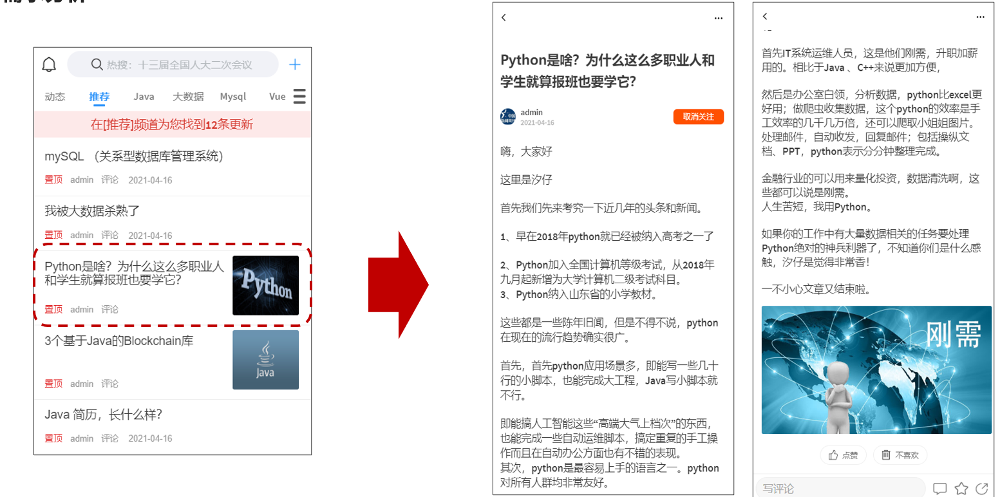

# 一、APP端文章列表加载

## 1.1 需求分析

文章布局展示


## 1.2 实现思路


1、在默认频道展示10条文章信息

2、可以切换频道查看不同种类文章

3、当用户下拉可以加载最新的文章（分页）本页文章列表中发布时间为最大的时间为依据

4、当用户上拉可以加载更多的文章信息（按照发布时间）本页文章列表中发布时间最小的时间为依据

5、如果是当前频道的首页，前端传递默认参数：

- maxBehotTime：0（毫秒）

- minBehotTime：20000000000000（毫秒）--->2063年


## 1.3 接口定义

|          | **加载首页**         | **加载更多**             | **加载最新**            |
| -------- | -------------------- | ------------------------ | ----------------------- |
| 接口路径 | /api/v1/article/load | /api/v1/article/loadmore | /api/v1/article/loadnew |
| 请求方式 | POST                 | POST                     | POST                    |
| 参数     | ArticleHomeDto       | ArticleHomeDto           | ArticleHomeDto          |
| 响应结果 | ResponseResult       | ResponseResult           | ResponseResult          |

ArticleHomeDto

```java
package com.leadnews.model.article.dtos;

import lombok.Data;

import java.util.Date;

@Data
public class ArticleHomeDto {

    // 最大时间
    Date maxBehotTime;
    // 最小时间
    Date minBehotTime;
    // 分页size
    Integer size;
    // 频道ID
    String tag;
}
```

需要在nacos中添加对应的配置leadnews-article


## 1.4 接口实现

### controller

```java
package com.leadnews.article.controller.v1;

import com.leadnews.article.service.ApArticleService;
import com.leadnews.common.constants.ArticleConstants;
import com.leadnews.model.article.dtos.ArticleHomeDto;
import com.leadnews.model.common.dtos.ResponseResult;
import org.springframework.beans.factory.annotation.Autowired;
import org.springframework.web.bind.annotation.PostMapping;
import org.springframework.web.bind.annotation.RequestBody;
import org.springframework.web.bind.annotation.RequestMapping;
import org.springframework.web.bind.annotation.RestController;

@RestController
@RequestMapping("/api/v1/article")
public class ArticleHomeController {


    @Autowired
    private ApArticleService apArticleService;

    @PostMapping("/load")
    public ResponseResult load(@RequestBody ArticleHomeDto dto) {
        return apArticleService.load(ArticleConstants.LOADTYPE_LOAD_MORE,dto);
    }

    @PostMapping("/loadmore")
    public ResponseResult loadMore(@RequestBody ArticleHomeDto dto) {
        return apArticleService.load(ArticleConstants.LOADTYPE_LOAD_MORE,dto);
    }

    @PostMapping("/loadnew")
    public ResponseResult loadNew(@RequestBody ArticleHomeDto dto) {
        return apArticleService.load(ArticleConstants.LOADTYPE_LOAD_NEW,dto);
    }
}
```


### service

```java
package com.leadnews.article.service;

import com.baomidou.mybatisplus.extension.service.IService;
import com.leadnews.model.article.dtos.ArticleHomeDto;
import com.leadnews.model.article.pojos.ApArticle;
import com.leadnews.model.common.dtos.ResponseResult;

import java.io.IOException;

public interface ApArticleService extends IService<ApArticle> {

    /**
     * 根据参数加载文章列表
     * @param loadtype 1为加载更多  2为加载最新
     * @param dto
     * @return
     */
    ResponseResult load(Short loadtype, ArticleHomeDto dto);

}
```

实现类：

```java
package com.leadnews.article.service.impl;

import com.baomidou.mybatisplus.extension.service.impl.ServiceImpl;
import com.leadnews.article.mapper.ApArticleMapper;
import com.leadnews.article.service.ApArticleService;
import com.leadnews.common.constants.ArticleConstants;
import com.leadnews.model.article.dtos.ArticleHomeDto;

import com.leadnews.model.article.pojos.ApArticle;
import com.leadnews.model.common.dtos.ResponseResult;
import lombok.extern.slf4j.Slf4j;
import org.apache.commons.lang3.StringUtils;
import org.springframework.beans.factory.annotation.Autowired;
import org.springframework.stereotype.Service;
import org.springframework.transaction.annotation.Transactional;

import java.util.Date;
import java.util.List;


@Service
@Transactional
@Slf4j
public class ApArticleServiceImpl  extends ServiceImpl<ApArticleMapper, ApArticle> implements ApArticleService {

    // 单页最大加载的数字
    private final static short MAX_PAGE_SIZE = 50;

    @Autowired
    private ApArticleMapper apArticleMapper;

    /**
     * 根据参数加载文章列表
     * @param loadtype 1为加载更多  2为加载最新
     * @param dto
     * @return
     */
    @Override
    public ResponseResult load(Short loadtype, ArticleHomeDto dto) {
        //1.校验参数
        Integer size = dto.getSize();
        if(size == null || size == 0){
            size = 10;
        }
        size = Math.min(size,MAX_PAGE_SIZE);
        dto.setSize(size);

        //类型参数检验
        if(!loadtype.equals(ArticleConstants.LOADTYPE_LOAD_MORE)&&!loadtype.equals(ArticleConstants.LOADTYPE_LOAD_NEW)){
            loadtype = ArticleConstants.LOADTYPE_LOAD_MORE;
        }
        //文章频道校验
        if(StringUtils.isEmpty(dto.getTag())){
            dto.setTag(ArticleConstants.DEFAULT_TAG);
        }

        //时间校验
        if(dto.getMaxBehotTime() == null) dto.setMaxBehotTime(new Date());
        if(dto.getMinBehotTime() == null) dto.setMinBehotTime(new Date());
        //2.查询数据
        List<ApArticle> apArticles = apArticleMapper.loadArticleList(dto, loadtype);

        //3.结果封装
        ResponseResult responseResult = ResponseResult.okResult(apArticles);
        return responseResult;
    }
    
}
```

定义常量类

```java
package com.leadnews.common.constants;

public class ArticleConstants {
    public static final Short LOADTYPE_LOAD_MORE = 1;
    public static final Short LOADTYPE_LOAD_NEW = 2;
    public static final String DEFAULT_TAG = "__all__";

}
```


### mapper

```java
package com.leadnews.article.mapper;

import com.baomidou.mybatisplus.core.mapper.BaseMapper;
import com.leadnews.model.article.dtos.ArticleHomeDto;
import com.leadnews.model.article.pojos.ApArticle;
import org.apache.ibatis.annotations.Mapper;
import org.apache.ibatis.annotations.Param;

import java.util.List;

@Mapper
public interface ApArticleMapper extends BaseMapper<ApArticle> {

    public List<ApArticle> loadArticleList(@Param("dto") ArticleHomeDto dto, @Param("type") Short type);

}
```

对应的映射文件

在resources中新建mapper/ApArticleMapper.xml     如下配置：

```xml
<?xml version="1.0" encoding="UTF-8"?>
<!DOCTYPE mapper PUBLIC "-//mybatis.org//DTD Mapper 3.0//EN" "http://mybatis.org/dtd/mybatis-3-mapper.dtd">
<mapper namespace="com.leadnews.article.mapper.ApArticleMapper">

    <resultMap id="resultMap" type="com.leadnews.model.article.pojos.ApArticle">
        <id column="id" property="id"/>
        <result column="title" property="title"/>
        <result column="author_id" property="authorId"/>
        <result column="author_name" property="authorName"/>
        <result column="channel_id" property="channelId"/>
        <result column="channel_name" property="channelName"/>
        <result column="layout" property="layout"/>
        <result column="flag" property="flag"/>
        <result column="images" property="images"/>
        <result column="labels" property="labels"/>
        <result column="likes" property="likes"/>
        <result column="collection" property="collection"/>
        <result column="comment" property="comment"/>
        <result column="views" property="views"/>
        <result column="province_id" property="provinceId"/>
        <result column="city_id" property="cityId"/>
        <result column="county_id" property="countyId"/>
        <result column="created_time" property="createdTime"/>
        <result column="publish_time" property="publishTime"/>
        <result column="sync_status" property="syncStatus"/>
        <result column="static_url" property="staticUrl"/>
    </resultMap>
    <select id="loadArticleList" resultMap="resultMap">
        SELECT
        aa.*
        FROM
        `ap_article` aa
        LEFT JOIN ap_article_config aac ON aa.id = aac.article_id
        <where>
            and aac.is_delete != 1
            and aac.is_down != 1
            <!-- loadmore -->
            <if test="type != null and type == 1">
                and aa.publish_time <![CDATA[<]]> #{dto.minBehotTime}
            </if>
            <if test="type != null and type == 2">
                and aa.publish_time <![CDATA[>]]> #{dto.maxBehotTime}
            </if>
            <if test="dto.tag != '__all__'">
                and aa.channel_id = #{dto.tag}
            </if>
        </where>
        order by aa.publish_time desc
        limit #{dto.size}
    </select>

</mapper>
```


## 1.5 封装MinIO为starter

### 1.5.1 创建模块leadnews-file-starter

导入依赖

```xml
<dependencies>
    <dependency>
        <groupId>org.springframework.boot</groupId>
        <artifactId>spring-boot-autoconfigure</artifactId>
    </dependency>
    <dependency>
        <groupId>io.minio</groupId>
        <artifactId>minio</artifactId>
        <version>7.1.0</version>
    </dependency>
    <dependency>
        <groupId>org.springframework.boot</groupId>
        <artifactId>spring-boot-starter</artifactId>
    </dependency>
    <dependency>
        <groupId>org.springframework.boot</groupId>
        <artifactId>spring-boot-configuration-processor</artifactId>
        <optional>true</optional>
    </dependency>
    <dependency>
        <groupId>org.springframework.boot</groupId>
        <artifactId>spring-boot-starter-actuator</artifactId>
    </dependency>
</dependencies>
```

### 1.5.2 配置类

MinIOConfigProperties

```java
package com.leadnews.file.config;

import lombok.Data;
import org.springframework.boot.context.properties.ConfigurationProperties;

import java.io.Serializable;

@Data
@ConfigurationProperties(prefix = "minio")  // 文件上传 配置前缀file.oss
public class MinIOConfigProperties implements Serializable {

    private String accessKey;
    private String secretKey;
    private String bucket;
    private String endpoint;
    private String readPath;
}
```

MinIOConfig

```java
package com.leadnews.file.config;

import com.leadnews.file.service.FileStorageService;
import io.minio.MinioClient;
import lombok.Data;
import org.springframework.beans.factory.annotation.Autowired;
import org.springframework.boot.autoconfigure.condition.ConditionalOnClass;
import org.springframework.boot.context.properties.EnableConfigurationProperties;
import org.springframework.context.annotation.Bean;
import org.springframework.context.annotation.Configuration;


@Data
@Configuration
@EnableConfigurationProperties({MinIOConfigProperties.class})
//当引入FileStorageService接口时
@ConditionalOnClass(FileStorageService.class)
public class MinIOConfig {

   @Autowired
   private MinIOConfigProperties minIOConfigProperties;

    @Bean
    public MinioClient buildMinioClient(){
        return MinioClient
                .builder()
                .credentials(minIOConfigProperties.getAccessKey(), minIOConfigProperties.getSecretKey())
                .endpoint(minIOConfigProperties.getEndpoint())
                .build();
    }
}
```

### 1.5.3 封装操作minIO类

FileStorageService

```java
package com.leadnews.file.service;

import java.io.InputStream;

public interface FileStorageService {


    /**
     *  上传图片文件
     * @param prefix  文件前缀
     * @param filename  文件名
     * @param inputStream 文件流
     * @return  文件全路径
     */
    public String uploadImgFile(String prefix, String filename,InputStream inputStream);

    /**
     *  上传html文件
     * @param prefix  文件前缀
     * @param filename   文件名
     * @param inputStream  文件流
     * @return  文件全路径
     */
    public String uploadHtmlFile(String prefix, String filename,InputStream inputStream);

    /**
     * 删除文件
     * @param pathUrl  文件全路径
     */
    public void delete(String pathUrl);

    /**
     * 下载文件
     * @param pathUrl  文件全路径
     * @return
     *
     */
    public byte[]  downLoadFile(String pathUrl);

}
```

MinIOFileStorageService

```java
package com.leadnews.file.service.impl;


import com.leadnews.file.config.MinIOConfig;
import com.leadnews.file.config.MinIOConfigProperties;
import com.leadnews.file.service.FileStorageService;
import io.minio.GetObjectArgs;
import io.minio.MinioClient;
import io.minio.PutObjectArgs;
import io.minio.RemoveObjectArgs;
import lombok.extern.slf4j.Slf4j;
import org.springframework.beans.factory.annotation.Autowired;
import org.springframework.boot.context.properties.EnableConfigurationProperties;
import org.springframework.context.annotation.Import;
import org.springframework.util.StringUtils;

import java.io.ByteArrayOutputStream;
import java.io.IOException;
import java.io.InputStream;
import java.text.SimpleDateFormat;
import java.util.Date;

@Slf4j
@EnableConfigurationProperties(MinIOConfigProperties.class)
@Import(MinIOConfig.class)
public class MinIOFileStorageService implements FileStorageService {

    @Autowired
    private MinioClient minioClient;

    @Autowired
    private MinIOConfigProperties minIOConfigProperties;

    private final static String separator = "/";

    /**
     * @param dirPath
     * @param filename  yyyy/mm/dd/file.jpg
     * @return
     */
    public String builderFilePath(String dirPath,String filename) {
        StringBuilder stringBuilder = new StringBuilder(50);
        if(!StringUtils.isEmpty(dirPath)){
            stringBuilder.append(dirPath).append(separator);
        }
        SimpleDateFormat sdf = new SimpleDateFormat("yyyy/MM/dd");
        String todayStr = sdf.format(new Date());
        stringBuilder.append(todayStr).append(separator);
        stringBuilder.append(filename);
        return stringBuilder.toString();
    }

    /**
     *  上传图片文件
     * @param prefix  文件前缀
     * @param filename  文件名
     * @param inputStream 文件流
     * @return  文件全路径
     */
    @Override
    public String uploadImgFile(String prefix, String filename,InputStream inputStream) {
        String filePath = builderFilePath(prefix, filename);
        try {
            PutObjectArgs putObjectArgs = PutObjectArgs.builder()
                    .object(filePath)
                    .contentType("image/jpg")
                    .bucket(minIOConfigProperties.getBucket()).stream(inputStream,inputStream.available(),-1)
                    .build();
            minioClient.putObject(putObjectArgs);
            StringBuilder urlPath = new StringBuilder(minIOConfigProperties.getReadPath());
            urlPath.append(separator+minIOConfigProperties.getBucket());
            urlPath.append(separator);
            urlPath.append(filePath);
            return urlPath.toString();
        }catch (Exception ex){
            log.error("minio put file error.",ex);
            throw new RuntimeException("上传文件失败");
        }
    }

    /**
     *  上传html文件
     * @param prefix  文件前缀
     * @param filename   文件名
     * @param inputStream  文件流
     * @return  文件全路径
     */
    @Override
    public String uploadHtmlFile(String prefix, String filename,InputStream inputStream) {
        String filePath = builderFilePath(prefix, filename);
        try {
            PutObjectArgs putObjectArgs = PutObjectArgs.builder()
                    .object(filePath)
                    .contentType("text/html")
                    .bucket(minIOConfigProperties.getBucket()).stream(inputStream,inputStream.available(),-1)
                    .build();
            minioClient.putObject(putObjectArgs);
            StringBuilder urlPath = new StringBuilder(minIOConfigProperties.getReadPath());
            urlPath.append(separator+minIOConfigProperties.getBucket());
            urlPath.append(separator);
            urlPath.append(filePath);
            return urlPath.toString();
        }catch (Exception ex){
            log.error("minio put file error.",ex);
            ex.printStackTrace();
            throw new RuntimeException("上传文件失败");
        }
    }

    /**
     * 删除文件
     * @param pathUrl  文件全路径
     */
    @Override
    public void delete(String pathUrl) {
        String key = pathUrl.replace(minIOConfigProperties.getEndpoint()+"/","");
        int index = key.indexOf(separator);
        String bucket = key.substring(0,index);
        String filePath = key.substring(index+1);
        // 删除Objects
        RemoveObjectArgs removeObjectArgs = RemoveObjectArgs.builder().bucket(bucket).object(filePath).build();
        try {
            minioClient.removeObject(removeObjectArgs);
        } catch (Exception e) {
            log.error("minio remove file error.  pathUrl:{}",pathUrl);
            e.printStackTrace();
        }
    }


    /**
     * 下载文件
     * @param pathUrl  文件全路径
     * @return  文件流
     *
     */
    @Override
    public byte[] downLoadFile(String pathUrl)  {
        String key = pathUrl.replace(minIOConfigProperties.getEndpoint()+"/","");
        int index = key.indexOf(separator);
        String bucket = key.substring(0,index);
        String filePath = key.substring(index+1);
        InputStream inputStream = null;
        try {
            inputStream = minioClient.getObject(GetObjectArgs.builder().bucket(minIOConfigProperties.getBucket()).object(filePath).build());
        } catch (Exception e) {
            log.error("minio down file error.  pathUrl:{}",pathUrl);
            e.printStackTrace();
        }

        ByteArrayOutputStream byteArrayOutputStream = new ByteArrayOutputStream();
        byte[] buff = new byte[100];
        int rc = 0;
        while (true) {
            try {
                if (!((rc = inputStream.read(buff, 0, 100)) > 0)) break;
            } catch (IOException e) {
                e.printStackTrace();
            }
            byteArrayOutputStream.write(buff, 0, rc);
        }
        return byteArrayOutputStream.toByteArray();
    }
}
```

### 1.5.4 对外加入自动配置

在resources中新建`META-INF/spring.factories`

```java
org.springframework.boot.autoconfigure.EnableAutoConfiguration=\
  com.leadnews.file.service.impl.MinIOFileStorageService
```


### 1.5.5 其他微服务使用

第一，导入leadnews-file-starter的依赖

第二，在微服务中添加minio所需要的配置

```yaml
minio:
  accessKey: minio
  secretKey: minio123
  bucket: leadnews
  endpoint: http://192.168.200.130:9000
  readPath: http://192.168.200.130:9000
```

第三，在对应使用的业务类中注入FileStorageService，样例如下：

```java
package com.leadnews.minio.test;


import com.leadnews.file.service.FileStorageService;
import com.leadnews.minio.MinioApplication;
import org.junit.Test;
import org.junit.runner.RunWith;
import org.springframework.beans.factory.annotation.Autowired;
import org.springframework.boot.test.context.SpringBootTest;
import org.springframework.test.context.junit4.SpringRunner;

import java.io.FileInputStream;
import java.io.FileNotFoundException;

@SpringBootTest(classes = MinioApplication.class)
@RunWith(SpringRunner.class)
public class MinioTest {

    @Autowired
    private FileStorageService fileStorageService;

    @Test
    public void testUpdateImgFile() {
        try {
            FileInputStream fileInputStream = new FileInputStream("E:\\tmp\\ak47.jpg");
            String filePath = fileStorageService.uploadImgFile("", "ak47.jpg", fileInputStream);
            System.out.println(filePath);
        } catch (FileNotFoundException e) {
            e.printStackTrace();
        }
    }
}
```


# 二、APP端文章详情展示

## 2.1 需求分析




## 2.2 实现方案


## 2.3 实现步骤

1.在artile微服务中添加MinIO和freemarker的支持。

2.将模板文件（article.ftl）拷贝到article微服务下：src/main/resources/templates/article.ftl。

article.ftl如下：

```html
<!DOCTYPE html>
<html>

<head>
    <meta charset="utf-8">
    <meta http-equiv="X-UA-Compatible" content="IE=edge">
    <meta name="viewport"
          content="width=device-width, initial-scale=1.0, maximum-scale=1.0, minimum-scale=1.0, viewport-fit=cover">
    <title>leadnews</title>
    <!-- 引入样式文件 -->
    <link rel="stylesheet" href="https://cdn.jsdelivr.net/npm/vant@2.12.20/lib/index.css">
    <!-- 页面样式 -->
    <link rel="stylesheet" href="../../../plugins/css/index.css">
</head>

<body>
<div id="app">
    <div class="article">
        <van-row>
            <van-col span="24" class="article-title" v-html="title"></van-col>
        </van-row>

        <van-row type="flex" align="center" class="article-header">
            <van-col span="3">
                <van-image round class="article-avatar" src="https://p3.pstatp.com/thumb/1480/7186611868"></van-image>
            </van-col>
            <van-col span="16">
                <div v-html="authorName"></div>
                <div>{{ publishTime | timestampToDateTime }}</div>
            </van-col>
            <van-col span="5">
                <van-button round :icon="relation.isfollow ? '' : 'plus'" type="info" class="article-focus"
                            :text="relation.isfollow ? '取消关注' : '关注'" :loading="followLoading" @click="handleClickArticleFollow">
                </van-button>
            </van-col>
        </van-row>

        <van-row class="article-content">
            <#if content??>
                <#list content as item>
                    <#if item.type='text'>
                        <van-col span="24" class="article-text">${item.value}</van-col>
                    <#else>
                        <van-col span="24" class="article-image">
                            <van-image width="100%" src="${item.value}"></van-image>
                        </van-col>
                    </#if>
                </#list>
            </#if>
        </van-row>

        <van-row type="flex" justify="center" class="article-action">
            <van-col>
                <van-button round :icon="relation.islike ? 'good-job' : 'good-job-o'" class="article-like"
                            :loading="likeLoading" :text="relation.islike ? '取消赞' : '点赞'" @click="handleClickArticleLike"></van-button>
                <van-button round :icon="relation.isunlike ? 'delete' : 'delete-o'" class="article-unlike"
                            :loading="unlikeLoading" @click="handleClickArticleUnlike">不喜欢</van-button>
            </van-col>
        </van-row>

        <!-- 文章评论列表 -->
        <van-list v-model="commentsLoading" :finished="commentsFinished" finished-text="没有更多了"
                  @load="onLoadArticleComments">
            <van-row id="#comment-view" type="flex" class="article-comment" v-for="(item, index) in comments" :key="index">
                <van-col span="3">
                    <van-image round src="https://p3.pstatp.com/thumb/1480/7186611868" class="article-avatar"></van-image>
                </van-col>
                <van-col span="21">
                    <van-row type="flex" align="center" justify="space-between">
                        <van-col class="comment-author" v-html="item.authorName"></van-col>
                        <van-col>
                            <van-button round :icon="item.operation === 0 ? 'good-job' : 'good-job-o'" size="normal"
                                        @click="handleClickCommentLike(item)">{{ item.likes || '' }}
                            </van-button>
                        </van-col>
                    </van-row>

                    <van-row>
                        <van-col class="comment-content" v-html="item.content"></van-col>
                    </van-row>
                    <van-row type="flex" align="center">
                        <van-col span="10" class="comment-time">
                            {{ item.createdTime | timestampToDateTime }}
                        </van-col>
                        <van-col span="3">
                            <van-button round size="normal" v-html="item.reply" @click="showCommentRepliesPopup(item.id)">回复 {{
                                item.reply || '' }}
                            </van-button>
                        </van-col>
                    </van-row>
                </van-col>
            </van-row>
        </van-list>
    </div>
    <!-- 文章底部栏 -->
    <van-row type="flex" justify="space-around" align="center" class="article-bottom-bar">
        <van-col span="13">
            <van-field v-model="commentValue" placeholder="写评论">
                <template #button>
                    <van-button icon="back-top" @click="handleSaveComment"></van-button>
                </template>
            </van-field>
        </van-col>
        <van-col span="3">
            <van-button icon="comment-o" @click="handleScrollIntoCommentView"></van-button>
        </van-col>
        <van-col span="3">
            <van-button :icon="relation.iscollection ? 'star' : 'star-o'" :loading="collectionLoading"
                        @click="handleClickArticleCollection"></van-button>
        </van-col>
        <van-col span="3">
            <van-button icon="share-o"></van-button>
        </van-col>
    </van-row>

    <!-- 评论Popup 弹出层 -->
    <van-popup v-model="showPopup" closeable position="bottom"
               :style="{ width: '750px', height: '60%', left: '50%', 'margin-left': '-375px' }">
        <!-- 评论回复列表 -->
        <van-list v-model="commentRepliesLoading" :finished="commentRepliesFinished" finished-text="没有更多了"
                  @load="onLoadCommentReplies">
            <van-row id="#comment-reply-view" type="flex" class="article-comment-reply"
                     v-for="(item, index) in commentReplies" :key="index">
                <van-col span="3">
                    <van-image round src="https://p3.pstatp.com/thumb/1480/7186611868" class="article-avatar"></van-image>
                </van-col>
                <van-col span="21">
                    <van-row type="flex" align="center" justify="space-between">
                        <van-col class="comment-author" v-html="item.authorName"></van-col>
                        <van-col>
                            <van-button round :icon="item.operation === 0 ? 'good-job' : 'good-job-o'" size="normal"
                                        @click="handleClickCommentReplyLike(item)">{{ item.likes || '' }}
                            </van-button>
                        </van-col>
                    </van-row>

                    <van-row>
                        <van-col class="comment-content" v-html="item.content"></van-col>
                    </van-row>
                    <van-row type="flex" align="center">
                        <!-- TODO: js计算时间差 -->
                        <van-col span="10" class="comment-time">
                            {{ item.createdTime | timestampToDateTime }}
                        </van-col>
                    </van-row>
                </van-col>
            </van-row>
        </van-list>
        <!-- 评论回复底部栏 -->
        <van-row type="flex" justify="space-around" align="center" class="comment-reply-bottom-bar">
            <van-col span="13">
                <van-field v-model="commentReplyValue" placeholder="写评论">
                    <template #button>
                        <van-button icon="back-top" @click="handleSaveCommentReply"></van-button>
                    </template>
                </van-field>
            </van-col>
            <van-col span="3">
                <van-button icon="comment-o"></van-button>
            </van-col>
            <van-col span="3">
                <van-button icon="star-o"></van-button>
            </van-col>
            <van-col span="3">
                <van-button icon="share-o"></van-button>
            </van-col>
        </van-row>
    </van-popup>
</div>

<!-- 引入 Vue 和 Vant 的 JS 文件 -->
<script src=" https://cdn.jsdelivr.net/npm/vue/dist/vue.min.js">
</script>
<script src="https://cdn.jsdelivr.net/npm/vant@2.12.20/lib/vant.min.js"></script>
<!-- 引入 Axios 的 JS 文件 -->
<#--<script src="https://unpkg.com/axios/dist/axios.min.js"></script>-->
<script src="../../../plugins/js/axios.min.js"></script>
<!-- 页面逻辑 -->
<script src="../../../plugins/js/index.js"></script>
</body>

</html>
```

3.将index.js和index.css两个文件手动上传到MinIO中


4.在文章微服务中导入依赖

```xml
<dependencies>
    <dependency>
        <groupId>org.springframework.boot</groupId>
        <artifactId>spring-boot-starter-freemarker</artifactId>
    </dependency>
    <dependency>
        <groupId>com.leadnews</groupId>
        <artifactId>leadnews-file-starter</artifactId>
        <version>1.0-SNAPSHOT</version>
    </dependency>
</dependencies>
```

5.新建ApArticleContentMapper

```java
package com.leadnews.article.mapper;

import com.baomidou.mybatisplus.core.mapper.BaseMapper;
import com.leadnews.model.article.pojos.ApArticleContent;
import org.apache.ibatis.annotations.Mapper;

@Mapper
public interface ApArticleContentMapper extends BaseMapper<ApArticleContent> {
}
```

6.在artile微服务中新增测试类（后期新增文章的时候创建详情静态页，目前暂时手动生成）

```java
package com.leadnews.article.test;


import com.alibaba.fastjson.JSONArray;
import com.baomidou.mybatisplus.core.toolkit.Wrappers;
import com.leadnews.article.ArticleApplication;
import com.leadnews.article.mapper.ApArticleContentMapper;
import com.leadnews.article.mapper.ApArticleMapper;
import com.leadnews.file.service.FileStorageService;
import com.leadnews.model.article.pojos.ApArticle;
import com.leadnews.model.article.pojos.ApArticleContent;
import freemarker.template.Configuration;
import freemarker.template.Template;
import org.apache.commons.lang3.StringUtils;
import org.junit.Test;
import org.junit.runner.RunWith;
import org.springframework.beans.factory.annotation.Autowired;
import org.springframework.boot.test.context.SpringBootTest;
import org.springframework.test.context.junit4.SpringRunner;

import java.io.ByteArrayInputStream;
import java.io.InputStream;
import java.io.StringWriter;
import java.util.HashMap;
import java.util.Map;

@SpringBootTest(classes = ArticleApplication.class)
@RunWith(SpringRunner.class)
public class ArticleFreemarkerTest {

    @Autowired
    private Configuration configuration;

    @Autowired
    private FileStorageService fileStorageService;


    @Autowired
    private ApArticleMapper apArticleMapper;

    @Autowired
    private ApArticleContentMapper apArticleContentMapper;

    @Test
    public void createStaticUrlTest() throws Exception {
        //1.获取文章内容
        ApArticleContent apArticleContent = apArticleContentMapper.selectOne(Wrappers.<ApArticleContent>lambdaQuery().eq(ApArticleContent::getArticleId, 1390536764510310401L));
        if(apArticleContent != null && StringUtils.isNotBlank(apArticleContent.getContent())){
            //2.文章内容通过freemarker生成html文件
            StringWriter out = new StringWriter();
            Template template = configuration.getTemplate("article.ftl");

            Map<String, Object> params = new HashMap<>();
            params.put("content", JSONArray.parseArray(apArticleContent.getContent()));

            template.process(params, out);
            InputStream is = new ByteArrayInputStream(out.toString().getBytes());

            //3.把html文件上传到minio中
            String path = fileStorageService.uploadHtmlFile("", apArticleContent.getArticleId() + ".html", is);

            //4.修改ap_article表，保存static_url字段
            ApArticle article = new ApArticle();
            article.setId(apArticleContent.getArticleId());
            article.setStaticUrl(path);
            apArticleMapper.updateById(article);

        }
    }
}
```


