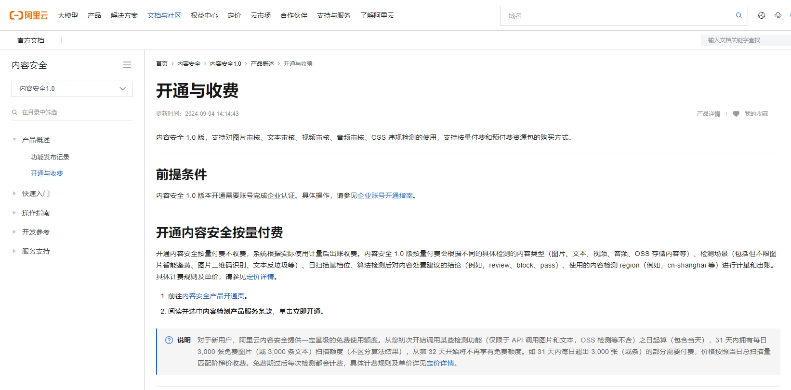
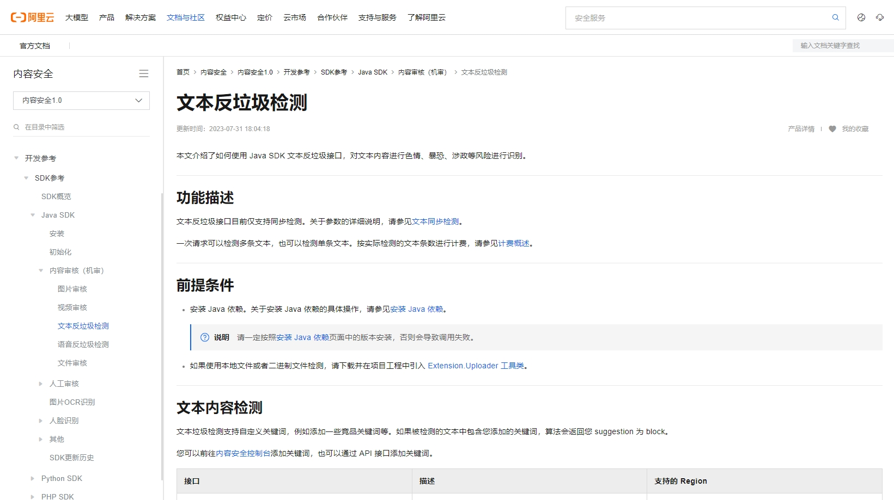
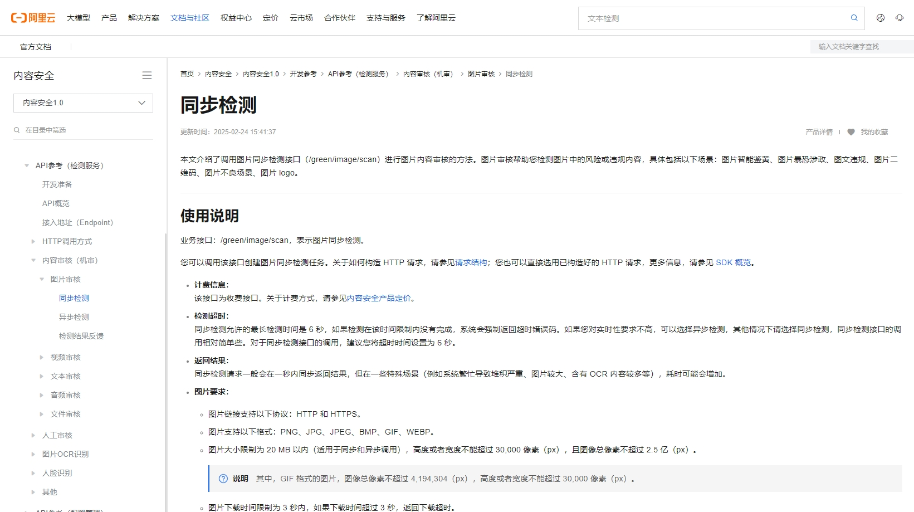
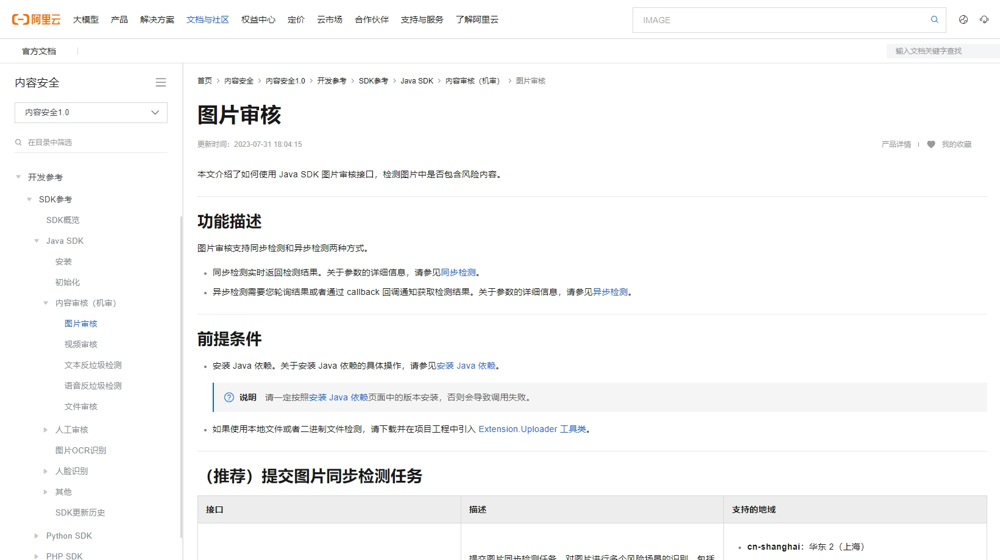
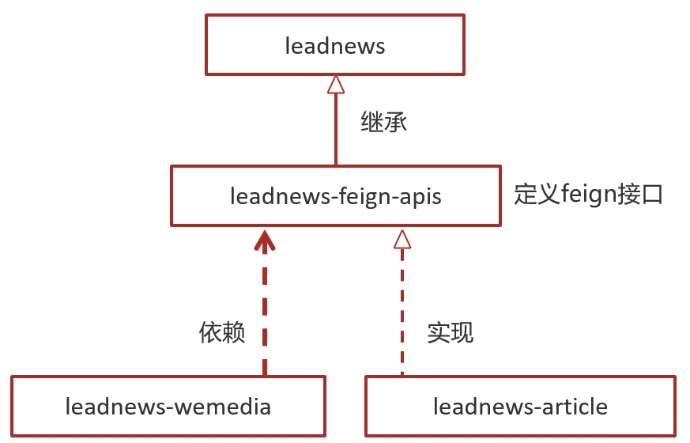
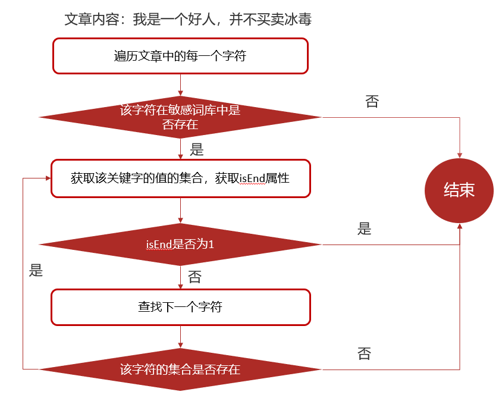
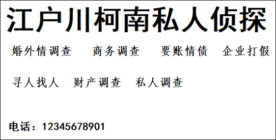

# 一、自媒体端文章自动审核

## 1.1 内容安全第三方接口

### 1.1.1 概述

内容安全是识别服务，支持对图片、视频、文本、语音等对象进行多样化场景检测，有效降低内容违规风险。

目前很多平台都支持内容检测，如阿里云、腾讯云、百度AI、网易云等国内大型互联网公司都对外提供了API。

按照性能和收费来看，本项目使用的是阿里云的内容安全接口，使用到了图片和文本的审核。

阿里云收费标准：

https://help.aliyun.com/document_detail/2573826.html?spm=a2c4g.11174283.0.0.6e3e1f55gwp5Rd


### 1.1.2 准备工作

在使用内容检测API之前，需要先注册阿里云账号，添加Access Key并签约云盾内容安全。

**操作步骤**

1. 前往[阿里云官网](https://www.aliyun.com/)注册账号。如果已有注册账号，请跳过此步骤。

   进入阿里云首页后，如果没有阿里云的账户需要先进行注册，才可以进行登录。由于注册较为简单，课程和讲义不在进行体现（注册可以使用多种方式，如淘宝账号、支付宝账号、微博账号等...）。

   需要实名认证和活体认证。

2. 打开[内容安全产品页面](https://help.aliyun.com/document_detail/69806.html?spm=a2c4g.11186623.0.0.4ff91f55YpNoAp)，开通服务。




### 1.1.3 文本内容审核接口

文本垃圾内容检测：https://help.aliyun.com/document_detail/70439.html?spm=a2c4g.11186623.help-menu-28415.d_3_1_4_2_0.4d9271b0UFip4O&scm=20140722.H_70439._.OR_help-T_cn~zh-V_1


文本垃圾内容Java SDK: https://help.aliyun.com/document_detail/53427.html?spm=a2c4g.11186623.6.717.466d7544QbU8Lr




### 1.1.4 图片审核接口

图片垃圾内容检测：https://help.aliyun.com/document_detail/70292.html?spm=a2c4g.11186623.6.616.5d7d1e7f9vDRz4



图片垃圾内容Java SDK: https://help.aliyun.com/document_detail/53424.html?spm=a2c4g.11186623.6.715.c8f69b12ey35j4




### 1.1.5 项目集成

将文本审核类和图片审核类集成到common模块下面，并添加到自动配置。

#### 文本审核 GreenTextScan

```java
package com.leadnews.common.aliyun;

import com.alibaba.fastjson.JSON;
import com.alibaba.fastjson.JSONArray;
import com.alibaba.fastjson.JSONObject;
import com.aliyuncs.DefaultAcsClient;
import com.aliyuncs.IAcsClient;
import com.aliyuncs.exceptions.ClientException;
import com.aliyuncs.exceptions.ServerException;
import com.aliyuncs.green.model.v20180509.TextScanRequest;
import com.aliyuncs.http.FormatType;
import com.aliyuncs.http.HttpResponse;
import com.aliyuncs.profile.DefaultProfile;
import com.aliyuncs.profile.IClientProfile;
import lombok.Getter;
import lombok.Setter;
import org.springframework.boot.context.properties.ConfigurationProperties;
import org.springframework.context.annotation.PropertySource;
import org.springframework.stereotype.Component;

import java.util.*;

@Getter
@Setter
@Component
@ConfigurationProperties(prefix = "aliyun")
public class GreenTextScan {

    private String accessKeyId;
    private String secret;

    public Map greeTextScan(String content) throws Exception {
        System.out.println(accessKeyId);
        IClientProfile profile = DefaultProfile
                .getProfile("cn-shanghai", accessKeyId, secret);
        DefaultProfile.addEndpoint("cn-shanghai", "cn-shanghai", "Green", "green.cn-shanghai.aliyuncs.com");
        IAcsClient client = new DefaultAcsClient(profile);
        TextScanRequest textScanRequest = new TextScanRequest();
        textScanRequest.setAcceptFormat(FormatType.JSON); // 指定api返回格式
        textScanRequest.setHttpContentType(FormatType.JSON);
        textScanRequest.setMethod(com.aliyuncs.http.MethodType.POST); // 指定请求方法
        textScanRequest.setEncoding("UTF-8");
        textScanRequest.setRegionId("cn-shanghai");
        List<Map<String, Object>> tasks = new ArrayList<Map<String, Object>>();
        Map<String, Object> task1 = new LinkedHashMap<String, Object>();
        task1.put("dataId", UUID.randomUUID().toString());
        /**
         * 待检测的文本，长度不超过10000个字符
         */
        task1.put("content", content);
        tasks.add(task1);
        JSONObject data = new JSONObject();

        /**
         * 检测场景，文本垃圾检测传递：antispam
         **/
        data.put("scenes", Arrays.asList("antispam"));
        data.put("tasks", tasks);
        System.out.println(JSON.toJSONString(data, true));
        textScanRequest.setHttpContent(data.toJSONString().getBytes("UTF-8"), "UTF-8", FormatType.JSON);
        // 请务必设置超时时间
        textScanRequest.setConnectTimeout(3000);
        textScanRequest.setReadTimeout(6000);

        Map<String, String> resultMap = new HashMap<>();
        try {
            HttpResponse httpResponse = client.doAction(textScanRequest);
            if (httpResponse.isSuccess()) {
                JSONObject scrResponse = JSON.parseObject(new String(httpResponse.getHttpContent(), "UTF-8"));
                System.out.println(JSON.toJSONString(scrResponse, true));
                if (200 == scrResponse.getInteger("code")) {
                    JSONArray taskResults = scrResponse.getJSONArray("data");
                    for (Object taskResult : taskResults) {
                        if (200 == ((JSONObject) taskResult).getInteger("code")) {
                            JSONArray sceneResults = ((JSONObject) taskResult).getJSONArray("results");
                            for (Object sceneResult : sceneResults) {
                                String scene = ((JSONObject) sceneResult).getString("scene");
                                String label = ((JSONObject) sceneResult).getString("label");
                                String suggestion = ((JSONObject) sceneResult).getString("suggestion");
                                System.out.println("suggestion = [" + label + "]");
                                if (!suggestion.equals("pass")) {
                                    resultMap.put("suggestion", suggestion);
                                    resultMap.put("label", label);
                                    return resultMap;
                                }

                            }
                        } else {
                            return null;
                        }
                    }
                    resultMap.put("suggestion", "pass");
                    return resultMap;
                } else {
                    return null;
                }
            } else {
                return null;
            }
        } catch (ServerException e) {
            e.printStackTrace();
        } catch (ClientException e) {
            e.printStackTrace();
        } catch (Exception e) {
            e.printStackTrace();
        }
        return null;
    }

}
```

#### 图片审核 GreenImageScan

```java
package com.leadnews.common.aliyun;

import com.alibaba.fastjson.JSON;
import com.alibaba.fastjson.JSONArray;
import com.alibaba.fastjson.JSONObject;
import com.aliyuncs.DefaultAcsClient;
import com.aliyuncs.IAcsClient;
import com.aliyuncs.green.model.v20180509.ImageSyncScanRequest;
import com.aliyuncs.http.FormatType;
import com.aliyuncs.http.HttpResponse;
import com.aliyuncs.http.MethodType;
import com.aliyuncs.http.ProtocolType;
import com.aliyuncs.profile.DefaultProfile;
import com.aliyuncs.profile.IClientProfile;
import com.leadnews.common.aliyun.util.ClientUploader;
import lombok.Getter;
import lombok.Setter;
import org.springframework.boot.context.properties.ConfigurationProperties;
import org.springframework.context.annotation.PropertySource;
import org.springframework.stereotype.Component;

import java.util.*;

@Getter
@Setter
@Component
@ConfigurationProperties(prefix = "aliyun")
public class GreenImageScan {

    private String accessKeyId;
    private String secret;
    private String scenes;

    public Map imageScan(List<byte[]> imageList) throws Exception {
        IClientProfile profile = DefaultProfile
            .getProfile("cn-shanghai", accessKeyId, secret);
        DefaultProfile
            .addEndpoint("cn-shanghai", "cn-shanghai", "Green", "green.cn-shanghai.aliyuncs.com");
        IAcsClient client = new DefaultAcsClient(profile);
        ImageSyncScanRequest imageSyncScanRequest = new ImageSyncScanRequest();
        // 指定api返回格式
        imageSyncScanRequest.setAcceptFormat(FormatType.JSON);
        // 指定请求方法
        imageSyncScanRequest.setMethod(MethodType.POST);
        imageSyncScanRequest.setEncoding("utf-8");
        //支持http和https
        imageSyncScanRequest.setProtocol(ProtocolType.HTTP);
        JSONObject httpBody = new JSONObject();
        /**
         * 设置要检测的场景, 计费是按照该处传递的场景进行
         * 一次请求中可以同时检测多张图片，每张图片可以同时检测多个风险场景，计费按照场景计算
         * 例如：检测2张图片，场景传递porn、terrorism，计费会按照2张图片鉴黄，2张图片暴恐检测计算
         * porn: porn表示色情场景检测
         */

        httpBody.put("scenes", Arrays.asList(scenes.split(",")));

        /**
         * 如果要检测的文件存于本地服务器上，可以通过下述代码片生成url
         * 再将返回的url作为图片地址传递到服务端进行检测
         */
        /**
         * 设置待检测图片， 一张图片一个task
         * 多张图片同时检测时，处理的时间由最后一个处理完的图片决定
         * 通常情况下批量检测的平均rt比单张检测的要长, 一次批量提交的图片数越多，rt被拉长的概率越高
         * 这里以单张图片检测作为示例, 如果是批量图片检测，请自行构建多个task
         */
        ClientUploader clientUploader = ClientUploader.getImageClientUploader(profile, false);
        String url = null;
        List<JSONObject> urlList = new ArrayList<JSONObject>();
        for (byte[] bytes : imageList) {
            url = clientUploader.uploadBytes(bytes);
            JSONObject task = new JSONObject();
            task.put("dataId", UUID.randomUUID().toString());
            //设置图片链接为上传后的url
            task.put("url", url);
            task.put("time", new Date());
            urlList.add(task);
        }
        httpBody.put("tasks", urlList);
        imageSyncScanRequest.setHttpContent(org.apache.commons.codec.binary.StringUtils.getBytesUtf8(httpBody.toJSONString()),
            "UTF-8", FormatType.JSON);
        /**
         * 请设置超时时间, 服务端全链路处理超时时间为10秒，请做相应设置
         * 如果您设置的ReadTimeout小于服务端处理的时间，程序中会获得一个read timeout异常
         */
        imageSyncScanRequest.setConnectTimeout(3000);
        imageSyncScanRequest.setReadTimeout(10000);
        HttpResponse httpResponse = null;
        try {
            httpResponse = client.doAction(imageSyncScanRequest);
        } catch (Exception e) {
            e.printStackTrace();
        }

        Map<String, String> resultMap = new HashMap<>();

        //服务端接收到请求，并完成处理返回的结果
        if (httpResponse != null && httpResponse.isSuccess()) {
            JSONObject scrResponse = JSON.parseObject(org.apache.commons.codec.binary.StringUtils.newStringUtf8(httpResponse.getHttpContent()));
            System.out.println(JSON.toJSONString(scrResponse, true));
            int requestCode = scrResponse.getIntValue("code");
            //每一张图片的检测结果
            JSONArray taskResults = scrResponse.getJSONArray("data");
            if (200 == requestCode) {
                for (Object taskResult : taskResults) {
                    //单张图片的处理结果
                    int taskCode = ((JSONObject) taskResult).getIntValue("code");
                    //图片要检测的场景的处理结果, 如果是多个场景，则会有每个场景的结果
                    JSONArray sceneResults = ((JSONObject) taskResult).getJSONArray("results");
                    if (200 == taskCode) {
                        for (Object sceneResult : sceneResults) {
                            String scene = ((JSONObject) sceneResult).getString("scene");
                            String label = ((JSONObject) sceneResult).getString("label");
                            String suggestion = ((JSONObject) sceneResult).getString("suggestion");
                            //根据scene和suggetion做相关处理
                            //do something
                            System.out.println("scene = [" + scene + "]");
                            System.out.println("suggestion = [" + suggestion + "]");
                            System.out.println("suggestion = [" + label + "]");
                            if (!suggestion.equals("pass")) {
                                resultMap.put("suggestion", suggestion);
                                resultMap.put("label", label);
                                return resultMap;
                            }
                        }

                    } else {
                        //单张图片处理失败, 原因视具体的情况详细分析
                        System.out.println("task process fail. task response:" + JSON.toJSONString(taskResult));
                        return null;
                    }
                }
                resultMap.put("suggestion","pass");
                return resultMap;
            } else {
                /**
                 * 表明请求整体处理失败，原因视具体的情况详细分析
                 */
                System.out.println("the whole image scan request failed. response:" + JSON.toJSONString(scrResponse));
                return null;
            }
        }
        return null;
    }
}
```


## 1.2 APP端文章保存

### 1.2.1 分布式id

随着业务的增长，文章表可能要占用很大的物理存储空间，为了解决该问题，后期使用数据库分片技术。将一个数据库进行拆分，通过数据库中间件连接。如果数据库中该表选用ID自增策略，则可能产生重复的ID，此时应该使用分布式ID生成策略来生成ID。


snowflake是Twitter开源的分布式ID生成算法，结果是一个long型的ID。其核心思想是：使用41bit作为毫秒数，10bit作为机器的ID（5个bit是数据中心，5个bit的机器ID），12bit作为毫秒内的流水号（意味着每个节点在每毫秒可以产生 4096 个 ID），最后还有一个符号位，永远是0


文章端相关的表都使用雪花算法生成id,包括ap_article、 ap_article_config、 ap_article_content

mybatis-plus已经集成了雪花算法，完成以下两步即可在项目中集成雪花算法

第一：在实体类中的id上加入如下配置，指定类型为id_worker

```java
@TableId(value = "id",type = IdType.ID_WORKER)
private Long id;
```

第二：在application.yml文件中配置数据中心id和机器id

```yaml
mybatis-plus:
  mapper-locations: classpath*:mapper/*.xml
  # 设置别名包扫描路径，通过该属性可以给包中的类注册别名
  type-aliases-package: com.leadnews.model.article.pojos
  global-config:
    datacenter-id: 1
    workerId: 1
```

datacenter-id:数据中心id(取值范围：0-31)

workerId:机器id(取值范围：0-31)


### 1.2.2 实现思路

在文章审核成功以后需要在app的article库中新增文章数据

1.保存文章信息 ap_article

2.保存文章配置信息 ap_article_config

3.保存文章内容 ap_article_content


### 1.2.3 接口定义

|          | **说明**             |
| -------- | -------------------- |
| 接口路径 | /api/v1/article/save |
| 请求方式 | POST                 |
| 参数     | ArticleDto           |
| 响应结果 | ResponseResult       |

ArticleDto

```java
package com.leadnews.model.article.dtos;

import com.leadnews.model.article.pojos.ApArticle;
import lombok.Data;

@Data
public class ArticleDto  extends ApArticle {
    /**
     * 文章内容
     */
    private String content;
}
```

成功：

```json
{
  "code": 200,
  "errorMessage" : "操作成功",
  "data":"1302864436297442242"
 }
```

失败：

```json
{
  "code":501,
  "errorMessage":"参数失效",
 }
```

```json
{
  "code":501,
  "errorMessage":"文章没有找到",
 }
```


### 1.2.4 接口实现

#### feign接口

①：在leadnews-feign-api中新增接口

第一：导入feign的依赖

```xml
<dependency>
    <groupId>org.springframework.cloud</groupId>
    <artifactId>spring-cloud-starter-openfeign</artifactId>
</dependency>
```

第二：定义文章端的接口

```java
package com.leadnews.apis.article;

import com.leadnews.model.article.dtos.ArticleDto;
import com.leadnews.model.common.dtos.ResponseResult;
import org.springframework.cloud.openfeign.FeignClient;
import org.springframework.web.bind.annotation.PostMapping;
import org.springframework.web.bind.annotation.RequestBody;

import java.io.IOException;


@FeignClient(value = "leadnews-article")
public interface IArticleClient {

    @PostMapping("/api/v1/article/save")
    public ResponseResult saveArticle(@RequestBody ArticleDto dto) ;
}
```

②：在leadnews-article中实现该方法

```java
package com.leadnews.article.feign;

import com.leadnews.apis.article.IArticleClient;
import com.leadnews.article.service.ApArticleService;
import com.leadnews.model.article.dtos.ArticleDto;
import com.leadnews.model.common.dtos.ResponseResult;
import org.springframework.beans.factory.annotation.Autowired;
import org.springframework.web.bind.annotation.*;

import java.io.IOException;

@RestController
public class ArticleClient implements IArticleClient {

    @Autowired
    private ApArticleService apArticleService;

    @Override
    @PostMapping("/api/v1/article/save")
    public ResponseResult saveArticle(@RequestBody ArticleDto dto) {
        return apArticleService.saveArticle(dto);
    }

}
```


#### service

在ApArticleService中新增方法

```java
/**
     * 保存app端相关文章
     * @param dto
     * @return
     */
ResponseResult saveArticle(ArticleDto dto) ;
```

实现类：

```java
@Autowired
private ApArticleConfigMapper apArticleConfigMapper;

@Autowired
private ApArticleContentMapper apArticleContentMapper;

/**
     * 保存app端相关文章
     * @param dto
     * @return
     */
@Override
public ResponseResult saveArticle(ArticleDto dto) {
    //1.检查参数
    if(dto == null){
        return ResponseResult.errorResult(AppHttpCodeEnum.PARAM_INVALID);
    }

    ApArticle apArticle = new ApArticle();
    BeanUtils.copyProperties(dto,apArticle);

    //2.判断是否存在id
    if(dto.getId() == null){
        //2.1 不存在id  保存  文章  文章配置  文章内容

        //保存文章
        save(apArticle);

        //保存配置
        ApArticleConfig apArticleConfig = new ApArticleConfig(apArticle.getId());
        apArticleConfigMapper.insert(apArticleConfig);

        //保存 文章内容
        ApArticleContent apArticleContent = new ApArticleContent();
        apArticleContent.setArticleId(apArticle.getId());
        apArticleContent.setContent(dto.getContent());
        apArticleContentMapper.insert(apArticleContent);

    }else {
        //2.2 存在id   修改  文章  文章内容

        //修改  文章
        updateById(apArticle);

        //修改文章内容
        ApArticleContent apArticleContent = apArticleContentMapper.selectOne(Wrappers.<ApArticleContent>lambdaQuery().eq(ApArticleContent::getArticleId, dto.getId()));
        apArticleContent.setContent(dto.getContent());
        apArticleContentMapper.updateById(apArticleContent);
    }


    //3.结果返回  文章的id
    return ResponseResult.okResult(apArticle.getId());
}
```


#### mapper

新增ApArticleConfigMapper类

```java
package com.leadnews.article.mapper;

import com.baomidou.mybatisplus.core.mapper.BaseMapper;
import com.leadnews.model.article.pojos.ApArticleConfig;
import org.apache.ibatis.annotations.Mapper;

@Mapper
public interface ApArticleConfigMapper extends BaseMapper<ApArticleConfig> {
}

```

同时，修改ApArticleConfig类，添加如下构造函数

```java
package com.leadnews.model.article.pojos;

import com.baomidou.mybatisplus.annotation.IdType;
import com.baomidou.mybatisplus.annotation.TableField;
import com.baomidou.mybatisplus.annotation.TableId;
import com.baomidou.mybatisplus.annotation.TableName;
import lombok.Data;
import lombok.NoArgsConstructor;

import java.io.Serializable;

/**
 * APP已发布文章配置表
 */

@Data
@NoArgsConstructor
@TableName("ap_article_config")
public class ApArticleConfig implements Serializable {


    public ApArticleConfig(Long articleId){
        this.articleId = articleId;
        this.isComment = true;
        this.isForward = true;
        this.isDelete = false;
        this.isDown = false;
    }

    @TableId(value = "id",type = IdType.ID_WORKER)
    private Long id;

    /**
     * 文章id
     */
    @TableField("article_id")
    private Long articleId;

    /**
     * 是否可评论
     * true: 可以评论   1
     * false: 不可评论  0
     */
    @TableField("is_comment")
    private Boolean isComment;

    /**
     * 是否转发
     * true: 可以转发   1
     * false: 不可转发  0
     */
    @TableField("is_forward")
    private Boolean isForward;

    /**
     * 是否下架
     * true: 下架   1
     * false: 没有下架  0
     */
    @TableField("is_down")
    private Boolean isDown;

    /**
     * 是否已删除
     * true: 删除   1
     * false: 没有删除  0
     */
    @TableField("is_delete")
    private Boolean isDelete;
}
```


#### 测试

编写junit单元测试，或使用Apifox进行测试

```json
{
	"id":1950034385470361602,
    "title":"leadnews项目标题",
    "authoId":1102,
    "layout":1,
    "labels":"leadnews",
    "publishTime":"2025-03-15T11:35:49.000Z",
    "images": "http://192.168.200.130:9000/leadnews/2025/03/15/5ddbdb5c68094ce393b08a47860da275.jpg",
    "content":"leadnews项目内容"
}
```


## 1.3 自媒体端文章自动审核

### 1.3.1 自媒体端文章自动审核流程


1、自媒体端发布文章后，开始审核文章

2、审核的主要是审核文章的内容（文本内容和图片）

3、借助第三方提供的接口审核文本

4、借助第三方提供的接口审核图片，由于图片存储到minIO中，需要先下载才能审核

5、如果审核失败，则需要修改自媒体文章的状态，status:2  审核失败    status:3  转到人工审核

6、如果审核成功，则需要在文章微服务中创建app端需要的文章


### 1.3.2 接口实现

#### service

在leadnews-wemedia中的service新增接口

```java
package com.leadnews.wemedia.service;

public interface WmNewsAutoScanService {

    /**
     * 自媒体文章审核
     * @param id  自媒体文章id
     */
    public void autoScanWmNews(Integer id);
}
```

实现类：

```java
package com.leadnews.wemedia.service.impl;

import com.alibaba.fastjson.JSONArray;
import com.leadnews.apis.article.IArticleClient;
import com.leadnews.common.aliyun.GreenImageScan;
import com.leadnews.common.aliyun.GreenTextScan;
import com.leadnews.file.service.FileStorageService;
import com.leadnews.model.article.dtos.ArticleDto;
import com.leadnews.model.common.dtos.ResponseResult;
import com.leadnews.model.wemedia.pojos.WmChannel;
import com.leadnews.model.wemedia.pojos.WmNews;
import com.leadnews.model.wemedia.pojos.WmUser;
import com.leadnews.wemedia.mapper.WmChannelMapper;
import com.leadnews.wemedia.mapper.WmNewsMapper;
import com.leadnews.wemedia.mapper.WmUserMapper;
import com.leadnews.wemedia.service.WmNewsAutoScanService;
import lombok.extern.slf4j.Slf4j;
import org.apache.commons.lang3.StringUtils;
import org.springframework.beans.BeanUtils;
import org.springframework.beans.factory.annotation.Autowired;
import org.springframework.stereotype.Service;
import org.springframework.transaction.annotation.Transactional;

import java.util.*;
import java.util.stream.Collectors;


@Service
@Slf4j
@Transactional
public class WmNewsAutoScanServiceImpl implements WmNewsAutoScanService {

    @Autowired
    private WmNewsMapper wmNewsMapper;

    /**
     * 自媒体文章审核
     *
     * @param id 自媒体文章id
     */
    @Override
    public void autoScanWmNews(Integer id) {
        //1.查询自媒体文章
        WmNews wmNews = wmNewsMapper.selectById(id);
        if(wmNews == null){
            throw new RuntimeException("WmNewsAutoScanServiceImpl-文章不存在");
        }

        if(wmNews.getStatus().equals(WmNews.Status.SUBMIT.getCode())){
            //从内容中提取纯文本内容和图片
            Map<String,Object> textAndImages = handleTextAndImages(wmNews);

            //2.审核文本内容  阿里云接口
            boolean isTextScan = handleTextScan((String) textAndImages.get("content"),wmNews);
            if(!isTextScan)return;

            //3.审核图片  阿里云接口
            boolean isImageScan =  handleImageScan((List<String>) textAndImages.get("images"),wmNews);
            if(!isImageScan)return;

            //4.审核成功，保存app端的相关的文章数据
            ResponseResult responseResult = saveAppArticle(wmNews);
            if(!responseResult.getCode().equals(200)){
                throw new RuntimeException("WmNewsAutoScanServiceImpl-文章审核，保存app端相关文章数据失败");
            }
            //回填article_id
            wmNews.setArticleId((Long) responseResult.getData());
            updateWmNews(wmNews,(short) 9,"审核成功");

        }
    }

    @Autowired
    private IArticleClient articleClient;

    @Autowired
    private WmChannelMapper wmChannelMapper;

    @Autowired
    private WmUserMapper wmUserMapper;

    /**
     * 保存app端相关的文章数据
     * @param wmNews
     */
    private ResponseResult saveAppArticle(WmNews wmNews) {

        ArticleDto dto = new ArticleDto();
        //属性的拷贝
        BeanUtils.copyProperties(wmNews,dto);
        //文章的布局
        dto.setLayout(wmNews.getType());
        //频道
        WmChannel wmChannel = wmChannelMapper.selectById(wmNews.getChannelId());
        if(wmChannel != null){
            dto.setChannelName(wmChannel.getName());
        }

        //作者
        dto.setAuthorId(wmNews.getUserId().longValue());
        WmUser wmUser = wmUserMapper.selectById(wmNews.getUserId());
        if(wmUser != null){
            dto.setAuthorName(wmUser.getName());
        }

        //设置文章id
        if(wmNews.getArticleId() != null){
            dto.setId(wmNews.getArticleId());
        }
        dto.setCreatedTime(new Date());

        ResponseResult responseResult = articleClient.saveArticle(dto);
        return responseResult;

    }


    @Autowired
    private FileStorageService fileStorageService;

    @Autowired
    private GreenImageScan greenImageScan;

    /**
     * 审核图片
     * @param images
     * @param wmNews
     * @return
     */
    private boolean handleImageScan(List<String> images, WmNews wmNews) {

        boolean flag = true;

        if(images == null || images.size() == 0){
            return flag;
        }

        //下载图片 minIO
        //图片去重
        images = images.stream().distinct().collect(Collectors.toList());

        List<byte[]> imageList = new ArrayList<>();

        for (String image : images) {
            byte[] bytes = fileStorageService.downLoadFile(image);
            imageList.add(bytes);
        }


        //审核图片
        try {
            Map map = greenImageScan.imageScan(imageList);
            if(map != null){
                //审核失败
                if(map.get("suggestion").equals("block")){
                    flag = false;
                    updateWmNews(wmNews, (short) 2, "当前文章中存在违规内容");
                }

                //不确定信息  需要人工审核
                if(map.get("suggestion").equals("review")){
                    flag = false;
                    updateWmNews(wmNews, (short) 3, "当前文章中存在不确定内容");
                }
            }

        } catch (Exception e) {
            flag = false;
            e.printStackTrace();
        }
        return flag;
    }

    @Autowired
    private GreenTextScan greenTextScan;

    /**
     * 审核纯文本内容
     * @param content
     * @param wmNews
     * @return
     */
    private boolean handleTextScan(String content, WmNews wmNews) {

        boolean flag = true;

        if((wmNews.getTitle()+"-"+content).length() == 0){
            return flag;
        }

        try {
            Map map = greenTextScan.greeTextScan((wmNews.getTitle()+"-"+content));
            if(map != null){
                //审核失败
                if(map.get("suggestion").equals("block")){
                    flag = false;
                    updateWmNews(wmNews, (short) 2, "当前文章中存在违规内容");
                }

                //不确定信息  需要人工审核
                if(map.get("suggestion").equals("review")){
                    flag = false;
                    updateWmNews(wmNews, (short) 3, "当前文章中存在不确定内容");
                }
            }
        } catch (Exception e) {
            flag = false;
            e.printStackTrace();
        }

        return flag;

    }

    /**
     * 修改文章内容
     * @param wmNews
     * @param status
     * @param reason
     */
    private void updateWmNews(WmNews wmNews, short status, String reason) {
        wmNews.setStatus(status);
        wmNews.setReason(reason);
        wmNewsMapper.updateById(wmNews);
    }

    /**
     * 1。从自媒体文章的内容中提取文本和图片
     * 2.提取文章的封面图片
     * @param wmNews
     * @return
     */
    private Map<String, Object> handleTextAndImages(WmNews wmNews) {

        //存储纯文本内容
        StringBuilder stringBuilder = new StringBuilder();

        List<String> images = new ArrayList<>();

        //1。从自媒体文章的内容中提取文本和图片
        if(StringUtils.isNotBlank(wmNews.getContent())){
            List<Map> maps = JSONArray.parseArray(wmNews.getContent(), Map.class);
            for (Map map : maps) {
                if (map.get("type").equals("text")){
                    stringBuilder.append(map.get("value"));
                }

                if (map.get("type").equals("image")){
                    images.add((String) map.get("value"));
                }
            }
        }
        //2.提取文章的封面图片
        if(StringUtils.isNotBlank(wmNews.getImages())){
            String[] split = wmNews.getImages().split(",");
            images.addAll(Arrays.asList(split));
        }

        Map<String, Object> resultMap = new HashMap<>();
        resultMap.put("content",stringBuilder.toString());
        resultMap.put("images",images);
        return resultMap;

    }
}
```


#### 单元测试

```java
package com.leadnews.wemedia.service;

import com.leadnews.wemedia.WemediaApplication;
import org.junit.Test;
import org.junit.runner.RunWith;
import org.springframework.beans.factory.annotation.Autowired;
import org.springframework.boot.test.context.SpringBootTest;
import org.springframework.test.context.junit4.SpringRunner;

import static org.junit.Assert.*;


@SpringBootTest(classes = WemediaApplication.class)
@RunWith(SpringRunner.class)
public class WmNewsAutoScanServiceTest {

    @Autowired
    private WmNewsAutoScanService wmNewsAutoScanService;

    @Test
    public void autoScanWmNews() {

        wmNewsAutoScanService.autoScanWmNews(6238);
    }
}
```


#### feign远程接口调用方式



在leadnews-wemedia服务中已经依赖了leadnews-feign-apis工程，只需要在自媒体的引导类中开启feign的远程调用即可

注解为：`@EnableFeignClients(basePackages = "com.leadnews.apis")` 需要指向apis这个包

```java
@SpringBootApplication
@EnableDiscoveryClient
@MapperScan("com.leadnews.wemedia.mapper")
@EnableFeignClients(basePackages = "com.leadnews.apis")
public class WemediaApplication {

    public static void main(String[] args) {
        SpringApplication.run(WemediaApplication.class,args);
    }

    @Bean
    public MybatisPlusInterceptor mybatisPlusInterceptor() {
        MybatisPlusInterceptor interceptor = new MybatisPlusInterceptor();
        interceptor.addInnerInterceptor(new PaginationInnerInterceptor(DbType.MYSQL));
        return interceptor;
    }
}
```


#### 服务降级处理

- 服务降级是服务自我保护的一种方式，或者保护下游服务的一种方式，用于确保服务不会受请求突增影响变得不可用，确保服务不会崩溃

- 服务降级虽然会导致请求失败，但是不会导致阻塞。

实现步骤：

①：在leadnews-feign-api编写降级逻辑

```java
package com.leadnews.apis.article.fallback;

import com.leadnews.apis.article.IArticleClient;
import com.leadnews.model.article.dtos.ArticleDto;
import com.leadnews.model.common.dtos.ResponseResult;
import com.leadnews.model.common.enums.AppHttpCodeEnum;
import org.springframework.stereotype.Component;

/**
 * feign失败配置
 */
@Component
public class IArticleClientFallback implements IArticleClient {
    @Override
    public ResponseResult saveArticle(ArticleDto dto)  {
        return ResponseResult.errorResult(AppHttpCodeEnum.SERVER_ERROR,"获取数据失败");
    }
}
```

在自媒体微服务中添加类，扫描降级代码类的包

```java
package com.leadnews.wemedia.config;

import org.springframework.context.annotation.ComponentScan;
import org.springframework.context.annotation.Configuration;

@Configuration
@ComponentScan("com.leadnews.apis.article.fallback")
public class InitConfig {
}
```

②：远程接口中指向降级代码

```java
package com.leadnews.apis.article;

import com.leadnews.apis.article.fallback.IArticleClientFallback;
import com.leadnews.model.article.dtos.ArticleDto;
import com.leadnews.model.common.dtos.ResponseResult;
import org.springframework.cloud.openfeign.FeignClient;
import org.springframework.web.bind.annotation.PostMapping;
import org.springframework.web.bind.annotation.RequestBody;

@FeignClient(value = "leadnews-article",fallback = IArticleClientFallback.class)
public interface IArticleClient {

    @PostMapping("/api/v1/article/save")
    public ResponseResult saveArticle(@RequestBody ArticleDto dto);
}
```

③：APP端开启降级leadnews-wemedia

在wemedia的nacos配置中心里添加如下内容，开启服务降级，也可以指定服务响应的超时的时间

```yaml
feign:
  # 开启feign对hystrix熔断降级的支持
  hystrix:
    enabled: true
  # 修改调用超时时间
  client:
    config:
      default:
        connectTimeout: 2000
        readTimeout: 2000
```

④：测试

在ApArticleServiceImpl类中saveArticle方法添加代码

```java
try {
    Thread.sleep(3000);
} catch (InterruptedException e) {
    e.printStackTrace();
}
```

在自媒体端进行审核测试，会出现服务降级的现象。


## 1.4 发布文章提交审核集成

### 1.4.1 同步调用与异步调用

同步：就是在发出一个调用时，在没有得到结果之前， 该调用就不返回（实时处理）

异步：调用在发出之后，这个调用就直接返回了，没有返回结果（分时处理）


异步线程的方式审核文章

### 1.4.2 Springboot集成异步线程调用

①：在自动审核的方法上加上@Async注解（标明要异步调用）

```java
@Override
@Async  //标明当前方法是一个异步方法
public void autoScanWmNews(Integer id) {
	//代码略
}
```

②：在文章发布成功后调用审核的方法

```java
@Autowired
private WmNewsAutoScanService wmNewsAutoScanService;

/**
 * 发布修改文章或保存为草稿
 * @param dto
 * @return
 */
@Override
public ResponseResult submitNews(WmNewsDto dto) {

    //代码略

    //审核文章
    wmNewsAutoScanService.autoScanWmNews(wmNews.getId());

    return ResponseResult.okResult(AppHttpCodeEnum.SUCCESS);

}
```

③：在自媒体引导类中使用@EnableAsync注解开启异步调用

```java
@SpringBootApplication
@EnableDiscoveryClient
@MapperScan("com.leadnews.wemedia.mapper")
@EnableFeignClients(basePackages = "com.leadnews.apis")
@EnableAsync  //开启异步调用
public class WemediaApplication {

    public static void main(String[] args) {
        SpringApplication.run(WemediaApplication.class,args);
    }

    @Bean
    public MybatisPlusInterceptor mybatisPlusInterceptor() {
        MybatisPlusInterceptor interceptor = new MybatisPlusInterceptor();
        interceptor.addInnerInterceptor(new PaginationInnerInterceptor(DbType.MYSQL));
        return interceptor;
    }
}
```


## 1.5 自管理敏感词

### 1.5.1 需求分析

文章审核功能已经交付了，文章也能正常发布审核。但是内容安全第三方接口不能完全满足需求。

- 文章审核不能过滤一些敏感词：

  私人侦探、针孔摄象、信用卡提现、广告代理、代开发票、刻章办、出售答案、小额贷款…

需要完成的功能：

需要自己维护一套敏感词，在文章审核的时候，需要验证文章是否包含这些敏感词

### 1.5.2 敏感词-过滤

技术选型

| **方案**               | **说明**                     |
| ---------------------- | ---------------------------- |
| 数据库模糊查询         | 效率太低                     |
| String.indexOf("")查找 | 数据库量大的话也是比较慢     |
| 全文检索               | 分词再匹配                   |
| DFA算法                | 确定有穷自动机(一种数据结构) |

### 1.5.3 DFA实现原理

DFA全称为：Deterministic Finite Automaton,即确定有穷自动机。

存储：一次性的把所有的敏感词存储到了多个map中，就是下图表示这种结构

敏感词：冰毒、大麻、大坏蛋


检索的过程



### 1.5.4 自管理敏感词集成到文章审核中

#### mapper

```java
package com.leadnews.wemedia.mapper;

import com.baomidou.mybatisplus.core.mapper.BaseMapper;
import com.leadnews.model.wemedia.pojos.WmSensitive;
import org.apache.ibatis.annotations.Mapper;


@Mapper
public interface WmSensitiveMapper extends BaseMapper<WmSensitive> {
}
```


#### 添加自管理敏感词审核

在文章审核的代码中添加自管理敏感词审核

第一：在WmNewsAutoScanServiceImpl中的autoScanWmNews方法上添加如下代码

```java
//从内容中提取纯文本内容和图片
//.....省略

//自管理的敏感词过滤
boolean isSensitive = handleSensitiveScan((String) textAndImages.get("content"), wmNews);
if(!isSensitive) return;

//2.审核文本内容  阿里云接口
//.....省略
```

新增自管理敏感词审核代码

```java
@Autowired
private WmSensitiveMapper wmSensitiveMapper;

/**
     * 自管理的敏感词审核
     * @param content
     * @param wmNews
     * @return
     */
private boolean handleSensitiveScan(String content, WmNews wmNews) {

    boolean flag = true;

    //获取所有的敏感词
    List<WmSensitive> wmSensitives = wmSensitiveMapper.selectList(Wrappers.<WmSensitive>lambdaQuery().select(WmSensitive::getSensitives));
    List<String> sensitiveList = wmSensitives.stream().map(WmSensitive::getSensitives).collect(Collectors.toList());

    //初始化敏感词库
    SensitiveWordUtil.initMap(sensitiveList);

    //查看文章中是否包含敏感词
    Map<String, Integer> map = SensitiveWordUtil.matchWords(content);
    if(map.size() >0){
        updateWmNews(wmNews,(short) 2,"当前文章中存在违规内容"+map);
        flag = false;
    }

    return flag;
}
```


## 1.6 图片识别文字审核敏感词

### 1.6.1 需求分析

文章中包含的图片要识别文字，过滤掉图片文字的敏感词。




### 1.6.2 图片文字识别

OCR （Optical Character Recognition，光学字符识别）是指电子设备（例如扫描仪或数码相机）检查纸上打印的字符，通过检测暗、亮的模式确定其形状，然后用字符识别方法将形状翻译成计算机文字的过程

| **方案**      | **说明**                                            |
| ------------- | --------------------------------------------------- |
| 百度OCR       | 收费                                                |
| Tesseract-OCR | Google维护的开源OCR引擎，支持Java，Python等语言调用 |
| Tess4J        | 封装了Tesseract-OCR  ，支持Java调用                 |


### 1.6.3 自管理敏感词和图片文字识别集成到文章审核

①：创建项目导入tess4j对应的依赖

```xml
<dependency>
    <groupId>net.sourceforge.tess4j</groupId>
    <artifactId>tess4j</artifactId>
    <version>4.1.1</version>
</dependency>
```

导入中文字体库 chi_sim.traineddata， 把tessdata文件夹拷贝到自己的工作空间下。


在leadnews-common中创建工具类，封装tess4j。

工具类

```java
package com.leadnews.common.tess4j;

import lombok.Getter;
import lombok.Setter;
import net.sourceforge.tess4j.ITesseract;
import net.sourceforge.tess4j.Tesseract;
import net.sourceforge.tess4j.TesseractException;
import org.springframework.boot.context.properties.ConfigurationProperties;
import org.springframework.stereotype.Component;

import java.awt.image.BufferedImage;

@Getter
@Setter
@Component
@ConfigurationProperties(prefix = "tess4j")
public class Tess4jClient {

    private String dataPath;
    private String language;

    public String doOCR(BufferedImage image) throws TesseractException {
        //创建Tesseract对象
        ITesseract tesseract = new Tesseract();
        //设置字体库路径
        tesseract.setDatapath(dataPath);
        //中文识别
        tesseract.setLanguage(language);
        //执行ocr识别
        String result = tesseract.doOCR(image);
        //替换回车和tal键  使结果为一行
        result = result.replaceAll("\\r|\\n", "-").replaceAll(" ", "");
        return result;
    }

}
```

在spring.factories配置中添加该类，完整如下：

```java
org.springframework.boot.autoconfigure.EnableAutoConfiguration=\
  com.leadnews.common.exception.ExceptionCatch,\
  com.leadnews.common.swagger.SwaggerConfiguration,\
  com.leadnews.common.swagger.Swagger2Configuration,\
  com.leadnews.common.aliyun.GreenTextScan,\
  com.leadnews.common.aliyun.GreenImageScan,\
  com.leadnews.common.tess4j.Tess4jClient
```

②：在leadnews-wemedia中的配置中添加两个属性

```yaml
tess4j:
  data-path: D:\workspace\tessdata
  language: chi_sim
```

③：在WmNewsAutoScanServiceImpl中的handleImageScan方法上添加如下代码

```java
try {
    for (String image : images) {
        byte[] bytes = fileStorageService.downLoadFile(image);

        //图片识别文字审核---begin-----

        //从byte[]转换为butteredImage
        ByteArrayInputStream in = new ByteArrayInputStream(bytes);
        BufferedImage imageFile = ImageIO.read(in);
        //识别图片的文字
        String result = tess4jClient.doOCR(imageFile);

        //审核是否包含自管理的敏感词
        boolean isSensitive = handleSensitiveScan(result, wmNews);
        if(!isSensitive){
            return isSensitive;
        }

        //图片识别文字审核---end-----


        imageList.add(bytes);

    } 
}catch (Exception e){
    e.printStackTrace();
}
```


文章审核的完整代码如下：

```java
package com.leadnews.wemedia.service.impl;

import com.alibaba.fastjson.JSONArray;
import com.baomidou.mybatisplus.core.toolkit.Wrappers;
import com.leadnews.apis.article.IArticleClient;
import com.leadnews.common.aliyun.GreenImageScan;
import com.leadnews.common.aliyun.GreenTextScan;
import com.leadnews.common.tess4j.Tess4jClient;
import com.leadnews.file.service.FileStorageService;
import com.leadnews.model.article.dtos.ArticleDto;
import com.leadnews.model.common.dtos.ResponseResult;
import com.leadnews.model.wemedia.pojos.WmChannel;
import com.leadnews.model.wemedia.pojos.WmNews;
import com.leadnews.model.wemedia.pojos.WmSensitive;
import com.leadnews.model.wemedia.pojos.WmUser;
import com.leadnews.utils.common.SensitiveWordUtil;
import com.leadnews.wemedia.mapper.WmChannelMapper;
import com.leadnews.wemedia.mapper.WmNewsMapper;
import com.leadnews.wemedia.mapper.WmSensitiveMapper;
import com.leadnews.wemedia.mapper.WmUserMapper;
import com.leadnews.wemedia.service.WmNewsAutoScanService;
import lombok.extern.slf4j.Slf4j;
import org.apache.commons.lang3.StringUtils;
import org.springframework.beans.BeanUtils;
import org.springframework.beans.factory.annotation.Autowired;
import org.springframework.scheduling.annotation.Async;
import org.springframework.stereotype.Service;
import org.springframework.transaction.annotation.Transactional;

import javax.imageio.ImageIO;
import java.awt.image.BufferedImage;
import java.io.ByteArrayInputStream;
import java.util.*;
import java.util.stream.Collectors;


@Service
@Slf4j
@Transactional
public class WmNewsAutoScanServiceImpl implements WmNewsAutoScanService {

    @Autowired
    private WmNewsMapper wmNewsMapper;

    /**
     * 自媒体文章审核
     *
     * @param id 自媒体文章id
     */
    @Override
    @Async  //标明当前方法是一个异步方法
    public void autoScanWmNews(Integer id) {

//        int a = 1/0;

        //1.查询自媒体文章
        WmNews wmNews = wmNewsMapper.selectById(id);
        if (wmNews == null) {
            throw new RuntimeException("WmNewsAutoScanServiceImpl-文章不存在");
        }

        if (wmNews.getStatus().equals(WmNews.Status.SUBMIT.getCode())) {
            //从内容中提取纯文本内容和图片
            Map<String, Object> textAndImages = handleTextAndImages(wmNews);

            //自管理的敏感词过滤
            boolean isSensitive = handleSensitiveScan((String) textAndImages.get("content"), wmNews);
            if(!isSensitive) return;

            //2.审核文本内容  阿里云接口
            boolean isTextScan = handleTextScan((String) textAndImages.get("content"), wmNews);
            if (!isTextScan) return;

            //3.审核图片  阿里云接口
            boolean isImageScan = handleImageScan((List<String>) textAndImages.get("images"), wmNews);
            if (!isImageScan) return;

            //4.审核成功，保存app端的相关的文章数据
            ResponseResult responseResult = saveAppArticle(wmNews);
            if (!responseResult.getCode().equals(200)) {
                throw new RuntimeException("WmNewsAutoScanServiceImpl-文章审核，保存app端相关文章数据失败");
            }
            //回填article_id
            wmNews.setArticleId((Long) responseResult.getData());
            updateWmNews(wmNews, (short) 9, "审核成功");

        }
    }

    @Autowired
    private WmSensitiveMapper wmSensitiveMapper;

    /**
     * 自管理的敏感词审核
     * @param content
     * @param wmNews
     * @return
     */
    private boolean handleSensitiveScan(String content, WmNews wmNews) {

        boolean flag = true;

        //获取所有的敏感词
        List<WmSensitive> wmSensitives = wmSensitiveMapper.selectList(Wrappers.<WmSensitive>lambdaQuery().select(WmSensitive::getSensitives));
        List<String> sensitiveList = wmSensitives.stream().map(WmSensitive::getSensitives).collect(Collectors.toList());

        //初始化敏感词库
        SensitiveWordUtil.initMap(sensitiveList);

        //查看文章中是否包含敏感词
        Map<String, Integer> map = SensitiveWordUtil.matchWords(content);
        if(map.size() >0){
            updateWmNews(wmNews,(short) 2,"当前文章中存在违规内容"+map);
            flag = false;
        }

        return flag;
    }

    @Autowired
    private IArticleClient articleClient;

    @Autowired
    private WmChannelMapper wmChannelMapper;

    @Autowired
    private WmUserMapper wmUserMapper;

    /**
     * 保存app端相关的文章数据
     *
     * @param wmNews
     */
    private ResponseResult saveAppArticle(WmNews wmNews) {

        ArticleDto dto = new ArticleDto();
        //属性的拷贝
        BeanUtils.copyProperties(wmNews, dto);
        //文章的布局
        dto.setLayout(wmNews.getType());
        //频道
        WmChannel wmChannel = wmChannelMapper.selectById(wmNews.getChannelId());
        if (wmChannel != null) {
            dto.setChannelName(wmChannel.getName());
        }

        //作者
        dto.setAuthorId(wmNews.getUserId().longValue());
        WmUser wmUser = wmUserMapper.selectById(wmNews.getUserId());
        if (wmUser != null) {
            dto.setAuthorName(wmUser.getName());
        }

        //设置文章id
        if (wmNews.getArticleId() != null) {
            dto.setId(wmNews.getArticleId());
        }
        dto.setCreatedTime(new Date());

        ResponseResult responseResult = articleClient.saveArticle(dto);
        return responseResult;

    }


    @Autowired
    private FileStorageService fileStorageService;

    @Autowired
    private GreenImageScan greenImageScan;

    @Autowired
    private Tess4jClient tess4jClient;

    /**
     * 审核图片
     *
     * @param images
     * @param wmNews
     * @return
     */
    private boolean handleImageScan(List<String> images, WmNews wmNews) {

        boolean flag = true;

        if (images == null || images.size() == 0) {
            return flag;
        }

        //下载图片 minIO
        //图片去重
        images = images.stream().distinct().collect(Collectors.toList());

        List<byte[]> imageList = new ArrayList<>();

        try {
            for (String image : images) {
                byte[] bytes = fileStorageService.downLoadFile(image);

                //图片识别文字审核---begin-----

                //从byte[]转换为butteredImage
                ByteArrayInputStream in = new ByteArrayInputStream(bytes);
                BufferedImage imageFile = ImageIO.read(in);
                //识别图片的文字
                String result = tess4jClient.doOCR(imageFile);

                //审核是否包含自管理的敏感词
                boolean isSensitive = handleSensitiveScan(result, wmNews);
                if(!isSensitive){
                    return isSensitive;
                }

                //图片识别文字审核---end-----


                imageList.add(bytes);

            }
        }catch (Exception e){
            e.printStackTrace();
        }


        //审核图片
        try {
            Map map = greenImageScan.imageScan(imageList);
            if (map != null) {
                //审核失败
                if (map.get("suggestion").equals("block")) {
                    flag = false;
                    updateWmNews(wmNews, (short) 2, "当前文章中存在违规内容");
                }

                //不确定信息  需要人工审核
                if (map.get("suggestion").equals("review")) {
                    flag = false;
                    updateWmNews(wmNews, (short) 3, "当前文章中存在不确定内容");
                }
            }

        } catch (Exception e) {
            flag = false;
            e.printStackTrace();
        }
        return flag;
    }

    @Autowired
    private GreenTextScan greenTextScan;

    /**
     * 审核纯文本内容
     *
     * @param content
     * @param wmNews
     * @return
     */
    private boolean handleTextScan(String content, WmNews wmNews) {

        boolean flag = true;

        if ((wmNews.getTitle() + "-" + content).length() == 0) {
            return flag;
        }
        try {
            Map map = greenTextScan.greeTextScan((wmNews.getTitle() + "-" + content));
            if (map != null) {
                //审核失败
                if (map.get("suggestion").equals("block")) {
                    flag = false;
                    updateWmNews(wmNews, (short) 2, "当前文章中存在违规内容");
                }

                //不确定信息  需要人工审核
                if (map.get("suggestion").equals("review")) {
                    flag = false;
                    updateWmNews(wmNews, (short) 3, "当前文章中存在不确定内容");
                }
            }
        } catch (Exception e) {
            flag = false;
            e.printStackTrace();
        }

        return flag;

    }

    /**
     * 修改文章内容
     *
     * @param wmNews
     * @param status
     * @param reason
     */
    private void updateWmNews(WmNews wmNews, short status, String reason) {
        wmNews.setStatus(status);
        wmNews.setReason(reason);
        wmNewsMapper.updateById(wmNews);
    }

    /**
     * 1。从自媒体文章的内容中提取文本和图片
     * 2.提取文章的封面图片
     *
     * @param wmNews
     * @return
     */
    private Map<String, Object> handleTextAndImages(WmNews wmNews) {

        //存储纯文本内容
        StringBuilder stringBuilder = new StringBuilder();

        List<String> images = new ArrayList<>();

        //1。从自媒体文章的内容中提取文本和图片
        if (StringUtils.isNotBlank(wmNews.getContent())) {
            List<Map> maps = JSONArray.parseArray(wmNews.getContent(), Map.class);
            for (Map map : maps) {
                if (map.get("type").equals("text")) {
                    stringBuilder.append(map.get("value"));
                }

                if (map.get("type").equals("image")) {
                    images.add((String) map.get("value"));
                }
            }
        }
        //2.提取文章的封面图片
        if (StringUtils.isNotBlank(wmNews.getImages())) {
            String[] split = wmNews.getImages().split(",");
            images.addAll(Arrays.asList(split));
        }

        Map<String, Object> resultMap = new HashMap<>();
        resultMap.put("content", stringBuilder.toString());
        resultMap.put("images", images);
        return resultMap;

    }
}
```


## 1.7 文章详情-静态文件生成

### 1.7.1 实现思路

文章端创建app相关文章时，生成文章详情静态页上传到MinIO中。


### 1.7.2 接口实现

#### service

1.新建ArticleFreemarkerService创建静态文件并上传到minIO中

```java
package com.leadnews.article.service;

import com.leadnews.model.article.pojos.ApArticle;

public interface ArticleFreemarkerService {

    /**
     * 生成静态文件上传到minIO中
     * @param apArticle
     * @param content
     */
    public void buildArticleToMinIO(ApArticle apArticle,String content);
}
```

实现类：

```java
package com.leadnews.article.service.impl;

import com.alibaba.fastjson.JSON;
import com.alibaba.fastjson.JSONArray;
import com.baomidou.mybatisplus.core.toolkit.Wrappers;
import com.leadnews.article.mapper.ApArticleContentMapper;
import com.leadnews.article.service.ApArticleService;
import com.leadnews.article.service.ArticleFreemarkerService;
import com.leadnews.file.service.FileStorageService;
import com.leadnews.model.article.pojos.ApArticle;
import freemarker.template.Configuration;
import freemarker.template.Template;
import lombok.extern.slf4j.Slf4j;
import org.apache.commons.lang3.StringUtils;
import org.springframework.beans.BeanUtils;
import org.springframework.beans.factory.annotation.Autowired;
import org.springframework.scheduling.annotation.Async;
import org.springframework.stereotype.Service;
import org.springframework.transaction.annotation.Transactional;

import java.io.ByteArrayInputStream;
import java.io.InputStream;
import java.io.StringWriter;
import java.util.HashMap;
import java.util.Map;

@Service
@Slf4j
@Transactional
public class ArticleFreemarkerServiceImpl implements ArticleFreemarkerService {

    @Autowired
    private ApArticleContentMapper apArticleContentMapper;

    @Autowired
    private Configuration configuration;

    @Autowired
    private FileStorageService fileStorageService;

    @Autowired
    private ApArticleService apArticleService;

    /**
     * 生成静态文件上传到minIO中
     * @param apArticle
     * @param content
     */
    @Async
    @Override
    public void buildArticleToMinIO(ApArticle apArticle, String content) {
        //已知文章的id
        //4.1 获取文章内容
        if(StringUtils.isNotBlank(content)){
            //4.2 文章内容通过freemarker生成html文件
            Template template = null;
            StringWriter out = new StringWriter();
            try {
                template = configuration.getTemplate("article.ftl");
                //数据模型
                Map<String,Object> contentDataModel = new HashMap<>();
                contentDataModel.put("content", JSONArray.parseArray(content));
                //合成
                template.process(contentDataModel,out);
            } catch (Exception e) {
                e.printStackTrace();
            }

            //4.3 把html文件上传到minio中
            InputStream in = new ByteArrayInputStream(out.toString().getBytes());
            String path = fileStorageService.uploadHtmlFile("", apArticle.getId() + ".html", in);


            //4.4 修改ap_article表，保存static_url字段
            apArticleService.update(Wrappers.<ApArticle>lambdaUpdate().eq(ApArticle::getId,apArticle.getId())
                    .set(ApArticle::getStaticUrl,path));


        }
    }

}
```

2.在ApArticleService的saveArticle实现方法中添加调用生成文件的方法

```java
/**
     * 保存app端相关文章
     * @param dto
     * @return
     */
@Override
public ResponseResult saveArticle(ArticleDto dto) {

    //        try {
    //            Thread.sleep(3000);
    //        } catch (InterruptedException e) {
    //            e.printStackTrace();
    //        }
    //1.检查参数
    if(dto == null){
        return ResponseResult.errorResult(AppHttpCodeEnum.PARAM_INVALID);
    }

    ApArticle apArticle = new ApArticle();
    BeanUtils.copyProperties(dto,apArticle);

    //2.判断是否存在id
    if(dto.getId() == null){
        //2.1 不存在id  保存  文章  文章配置  文章内容

        //保存文章
        save(apArticle);

        //保存配置
        ApArticleConfig apArticleConfig = new ApArticleConfig(apArticle.getId());
        apArticleConfigMapper.insert(apArticleConfig);

        //保存 文章内容
        ApArticleContent apArticleContent = new ApArticleContent();
        apArticleContent.setArticleId(apArticle.getId());
        apArticleContent.setContent(dto.getContent());
        apArticleContentMapper.insert(apArticleContent);

    }else {
        //2.2 存在id   修改  文章  文章内容

        //修改  文章
        updateById(apArticle);

        //修改文章内容
        ApArticleContent apArticleContent = apArticleContentMapper.selectOne(Wrappers.<ApArticleContent>lambdaQuery().eq(ApArticleContent::getArticleId, dto.getId()));
        apArticleContent.setContent(dto.getContent());
        apArticleContentMapper.updateById(apArticleContent);
    }

    //异步调用 生成静态文件上传到minio中
    articleFreemarkerService.buildArticleToMinIO(apArticle,dto.getContent());


    //3.结果返回  文章的id
    return ResponseResult.okResult(apArticle.getId());
}
```


#### 启动类

文章微服务ArticleApplication开启异步调用@EnableAsync

```java
@SpringBootApplication
@EnableDiscoveryClient
@MapperScan("com.leadnews.article.mapper")
@EnableAsync
@EnableFeignClients(basePackages = "com.leadnews.apis")
public class ArticleApplication {

    public static void main(String[] args) {
        SpringApplication.run(ArticleApplication.class,args);
    }

    @Bean
    public MybatisPlusInterceptor mybatisPlusInterceptor() {
        MybatisPlusInterceptor interceptor = new MybatisPlusInterceptor();
        interceptor.addInnerInterceptor(new PaginationInnerInterceptor(DbType.MYSQL));
        return interceptor;
    }
}
```


