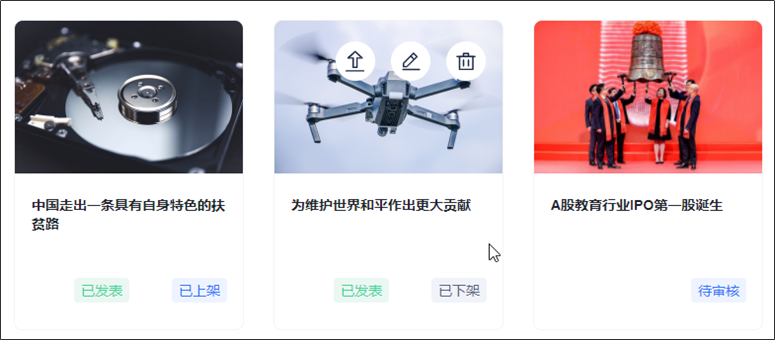
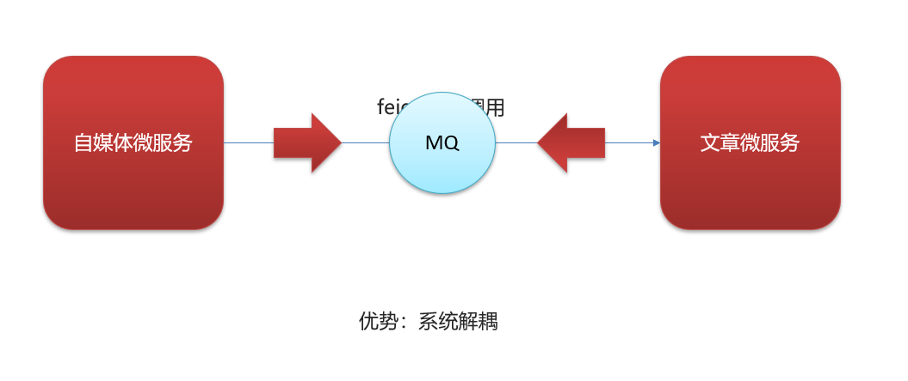
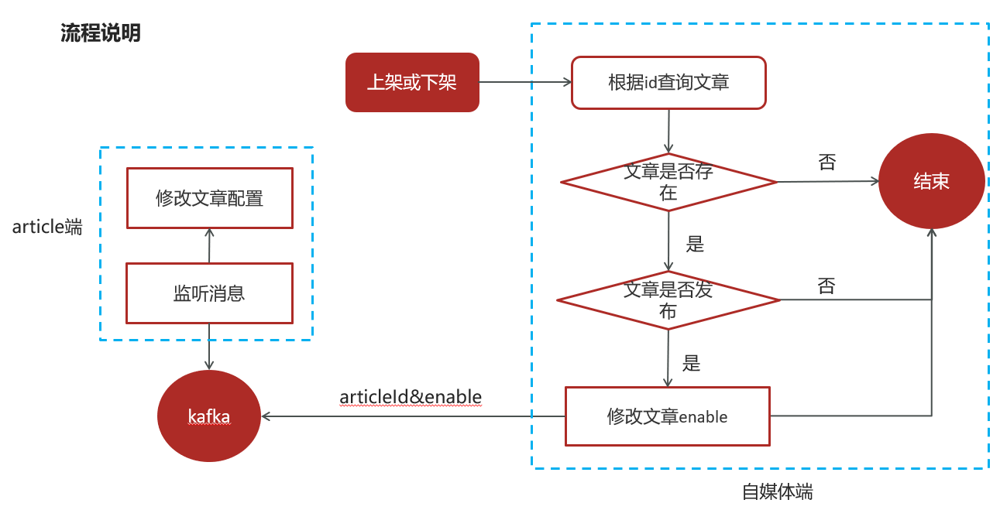

# 一、kafka

## 1.1 springboot集成kafka

### 1.1.1 导入依赖

导入spring-kafka依赖信息

```xml
<dependencies>
    <dependency>
        <groupId>org.springframework.boot</groupId>
        <artifactId>spring-boot-starter-web</artifactId>
    </dependency>
    <!-- kafkfa -->
    <dependency>
        <groupId>org.springframework.kafka</groupId>
        <artifactId>spring-kafka</artifactId>
        <exclusions>
            <exclusion>
                <groupId>org.apache.kafka</groupId>
                <artifactId>kafka-clients</artifactId>
            </exclusion>
        </exclusions>
    </dependency>
    <dependency>
        <groupId>org.apache.kafka</groupId>
        <artifactId>kafka-clients</artifactId>
    </dependency>
    <dependency>
        <groupId>com.alibaba</groupId>
        <artifactId>fastjson</artifactId>
    </dependency>
</dependencies>
```

### 1.1.2 配置

在resources下创建文件application.yml

```yaml
server:
  port: 9991
spring:
  application:
    name: kafka-demo
  kafka:
    bootstrap-servers: 192.168.200.130:9092
    producer:
      retries: 10
      key-serializer: org.apache.kafka.common.serialization.StringSerializer
      value-serializer: org.apache.kafka.common.serialization.StringSerializer
    consumer:
      group-id: ${spring.application.name}-test
      key-deserializer: org.apache.kafka.common.serialization.StringDeserializer
      value-deserializer: org.apache.kafka.common.serialization.StringDeserializer
```

### 1.1.3 消息生产者

```java
package com.leadnews.kafka.controller;

import org.springframework.beans.factory.annotation.Autowired;
import org.springframework.kafka.core.KafkaTemplate;
import org.springframework.web.bind.annotation.GetMapping;
import org.springframework.web.bind.annotation.RestController;

@RestController
public class HelloController {

    @Autowired
    private KafkaTemplate<String,String> kafkaTemplate;

    @GetMapping("/hello")
    public String hello(){
        kafkaTemplate.send("itcast-topic","hello kafka");
        return "ok";
    }
}
```

### 1.1.4 消息消费者

```java
package com.leadnews.kafka.listener;

import org.springframework.kafka.annotation.KafkaListener;
import org.springframework.stereotype.Component;
import org.springframework.util.StringUtils;

@Component
public class HelloListener {

    @KafkaListener(topics = "itcast-topic")
    public void onMessage(String message){
        if(!StringUtils.isEmpty(message)){
            System.out.println(message);
        }

    }
}
```

### 1.1.5 传递消息为对象

目前springboot整合后的kafka，因为序列化器是StringSerializer，这个时候如果需要传递对象可以有两种方式

方式一：可以自定义序列化器，对象类型众多，这种方式通用性不强，本章节不介绍

方式二：可以把要传递的对象进行转json字符串，接收消息后再转为对象即可，本项目采用这种方式

- 发送消息

```java
@GetMapping("/hello")
public String hello(){
    User user = new User();
    user.setUsername("xiaowang");
    user.setAge(18);

    kafkaTemplate.send("user-topic", JSON.toJSONString(user));

    return "ok";
}
```

- 接收消息

```java
package com.leadnews.kafka.listener;

import com.alibaba.fastjson.JSON;
import com.leadnews.kafka.pojo.User;
import org.springframework.kafka.annotation.KafkaListener;
import org.springframework.stereotype.Component;
import org.springframework.util.StringUtils;

@Component
public class HelloListener {

    @KafkaListener(topics = "user-topic")
    public void onMessage(String message){
        if(!StringUtils.isEmpty(message)){
            User user = JSON.parseObject(message, User.class);
            System.out.println(user);
        }

    }
}
```


# 二、异步通知文章上下架

## 2.1 自媒体端文章上下架

### 2.1.1 需求分析

已发表的文章可以上架


已发表的文章可以下架






### 2.1.2 实现思路




### 2.1.3 接口定义

|          | **说明**                |
| -------- | ----------------------- |
| 接口路径 | /api/v1/news/down_or_up |
| 请求方式 | POST                    |
| 参数     | DTO                     |
| 响应结果 | ResponseResult          |

 DTO  

```java
@Data
public class WmNewsDto {
    
    private Integer id;
    /**
    * 是否上架  0 下架  1 上架
    */
    private Short enable;
                       
}
```

ResponseResult  


### 2.1.4 自媒体端文章上下架接口实现

#### WmNewsDto

在WmNewsDto中新增enable属性 ，完整的代码如下：

```java
package com.leadnews.model.wemedia.dtos;

import lombok.Data;

import java.util.Date;
import java.util.List;

@Data
public class WmNewsDto {
    
    private Integer id;
     /**
     * 标题
     */
    private String title;
     /**
     * 频道id
     */
    private Integer channelId;
     /**
     * 标签
     */
    private String labels;
     /**
     * 发布时间
     */
    private Date publishTime;
     /**
     * 文章内容
     */
    private String content;
     /**
     * 文章封面类型  0 无图 1 单图 3 多图 -1 自动
     */
    private Short type;
     /**
     * 提交时间
     */
    private Date submitedTime; 
     /**
     * 状态 提交为1  草稿为0
     */
    private Short status;
     
     /**
     * 封面图片列表 多张图以逗号隔开
     */
    private List<String> images;

    /**
     * 上下架 0 下架  1 上架
     */
    private Short enable;
}
```


#### controller

在leadnews-wemedia工程下的WmNewsController新增方法

```java
@PostMapping("/down_or_up")
public ResponseResult downOrUp(@RequestBody WmNewsDto dto){
    return wmNewsService.downOrUp(dto);
}
```


#### service

在WmNewsService新增方法

```java
/**
 * 文章的上下架
 * @param dto
 * @return
 */
public ResponseResult downOrUp(WmNewsDto dto);
```

实现方法

```java
/**
 * 文章的上下架
 * @param dto
 * @return
 */
@Override
public ResponseResult downOrUp(WmNewsDto dto) {
    //1.检查参数
    if(dto.getId() == null){
        return ResponseResult.errorResult(AppHttpCodeEnum.PARAM_INVALID);
    }

    //2.查询文章
    WmNews wmNews = getById(dto.getId());
    if(wmNews == null){
        return ResponseResult.errorResult(AppHttpCodeEnum.DATA_NOT_EXIST,"文章不存在");
    }

    //3.判断文章是否已发布
    if(!wmNews.getStatus().equals(WmNews.Status.PUBLISHED.getCode())){
        return ResponseResult.errorResult(AppHttpCodeEnum.PARAM_INVALID,"当前文章不是发布状态，不能上下架");
    }

    //4.修改文章enable
    if(dto.getEnable() != null && dto.getEnable() > -1 && dto.getEnable() < 2){
        update(Wrappers.<WmNews>lambdaUpdate().set(WmNews::getEnable,dto.getEnable())
                .eq(WmNews::getId,wmNews.getId()));
    }
    return ResponseResult.okResult(AppHttpCodeEnum.SUCCESS);
}
```


### 2.1.5 消息通知article端文章上下架

#### 导入依赖

在leadnews-common模块下导入kafka依赖

```xml
<!-- kafkfa -->
<dependency>
    <groupId>org.springframework.kafka</groupId>
    <artifactId>spring-kafka</artifactId>
</dependency>
<dependency>
    <groupId>org.apache.kafka</groupId>
    <artifactId>kafka-clients</artifactId>
</dependency>
```

#### nacos配置

在自媒体端的nacos配置中心配置kafka的生产者

```yaml
spring:
  kafka:
    bootstrap-servers: 192.168.200.130:9092
    producer:
      retries: 10
      key-serializer: org.apache.kafka.common.serialization.StringSerializer
      value-serializer: org.apache.kafka.common.serialization.StringSerializer
```

在article端的nacos配置中心配置kafka的消费者

```yaml
spring:
  kafka:
    bootstrap-servers: 192.168.200.130:9092
    consumer:
      group-id: ${spring.application.name}
      key-deserializer: org.apache.kafka.common.serialization.StringDeserializer
      value-deserializer: org.apache.kafka.common.serialization.StringDeserializer
```

#### 常量类

```java
public class WmNewsMessageConstants {

    public static final String WM_NEWS_UP_OR_DOWN_TOPIC="wm.news.up.or.down.topic";
}
```

#### 发送消息

在自媒体端文章上下架后发送消息

```java
//发送消息，通知article端修改文章配置
if(wmNews.getArticleId() != null){
    Map<String,Object> map = new HashMap<>();
    map.put("articleId",wmNews.getArticleId());
    map.put("enable",dto.getEnable());
    kafkaTemplate.send(WmNewsMessageConstants.WM_NEWS_UP_OR_DOWN_TOPIC,JSON.toJSONString(map));
}
```

#### 接收消息

在article端编写监听，接收消息

```java
package com.leadnews.article.listener;

import com.alibaba.fastjson.JSON;
import com.leadnews.article.service.ApArticleConfigService;
import lombok.extern.slf4j.Slf4j;
import org.apache.commons.lang3.StringUtils;
import org.springframework.beans.factory.annotation.Autowired;
import org.springframework.kafka.annotation.KafkaListener;
import org.springframework.stereotype.Component;

import java.util.Map;

@Component
@Slf4j
public class ArtilceIsDownListener {

    @Autowired
    private ApArticleConfigService apArticleConfigService;

    @KafkaListener(topics = WmNewsMessageConstants.WM_NEWS_UP_OR_DOWN_TOPIC)
    public void onMessage(String message){
        if(StringUtils.isNotBlank(message)){
            Map map = JSON.parseObject(message, Map.class);
            apArticleConfigService.updateByMap(map);
            log.info("article端文章配置修改，articleId={}",map.get("articleId"));
        }
    }
}
```

#### service

新建ApArticleConfigService

```java
package com.leadnews.article.service;

import com.baomidou.mybatisplus.extension.service.IService;
import com.leadnews.model.article.pojos.ApArticleConfig;

import java.util.Map;

public interface ApArticleConfigService extends IService<ApArticleConfig> {

    /**
     * 修改文章配置
     * @param map
     */
    public void updateByMap(Map map);
}
```

实现类：

```java
package com.leadnews.article.service.impl;

import com.baomidou.mybatisplus.core.toolkit.Wrappers;
import com.baomidou.mybatisplus.extension.service.impl.ServiceImpl;
import com.leadnews.article.mapper.ApArticleConfigMapper;
import com.leadnews.article.service.ApArticleConfigService;
import com.leadnews.model.article.pojos.ApArticleConfig;
import lombok.extern.slf4j.Slf4j;
import org.springframework.stereotype.Service;
import org.springframework.transaction.annotation.Transactional;

import java.util.Map;

@Service
@Slf4j
@Transactional
public class ApArticleConfigServiceImpl extends ServiceImpl<ApArticleConfigMapper, ApArticleConfig> implements ApArticleConfigService {


    /**
     * 修改文章配置
     * @param map
     */
    @Override
    public void updateByMap(Map map) {
        //0 下架 1 上架
        Object enable = map.get("enable");
        boolean isDown = true;
        if(enable.equals(1)){
            isDown = false;
        }
        //修改文章配置
        update(Wrappers.<ApArticleConfig>lambdaUpdate().eq(ApArticleConfig::getArticleId,map.get("articleId")).set(ApArticleConfig::getIsDown,isDown));

    }
}
```


